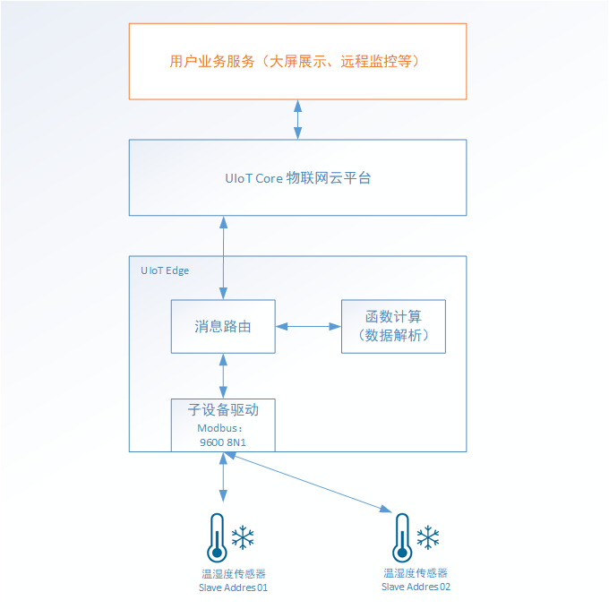
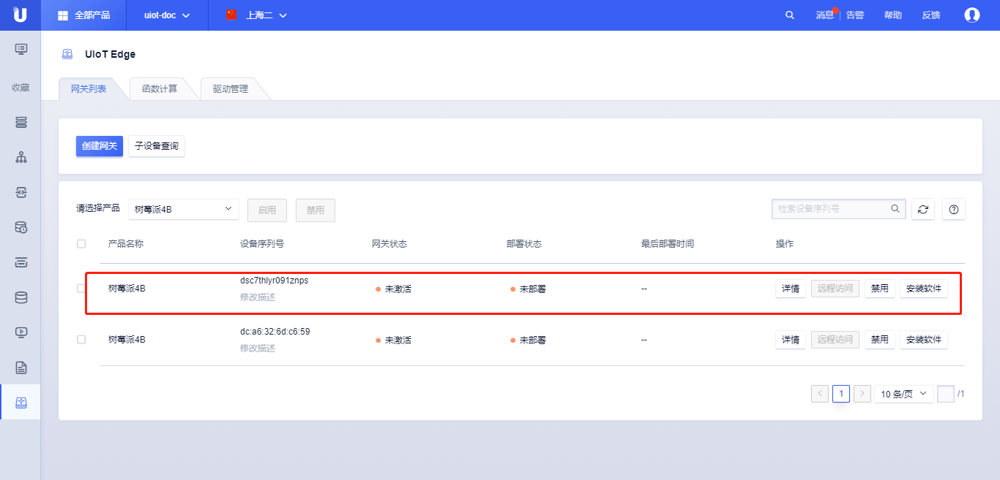
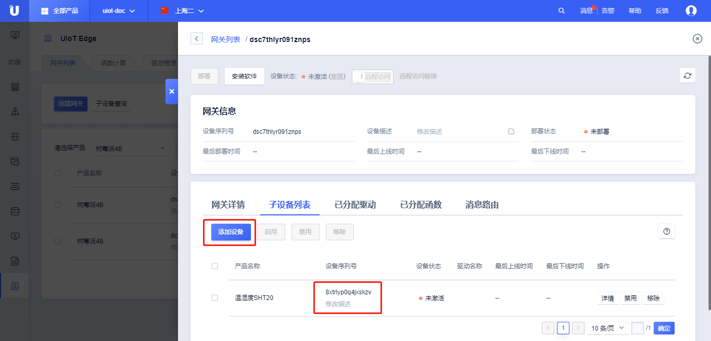
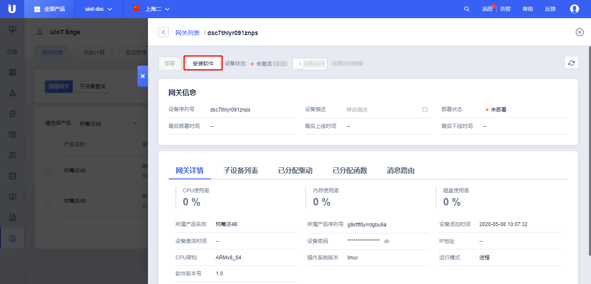
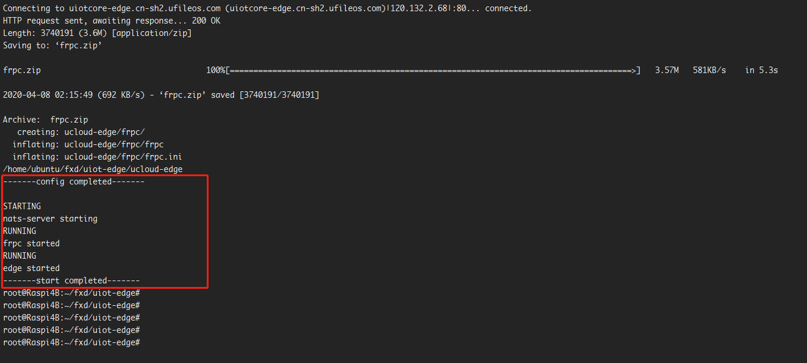
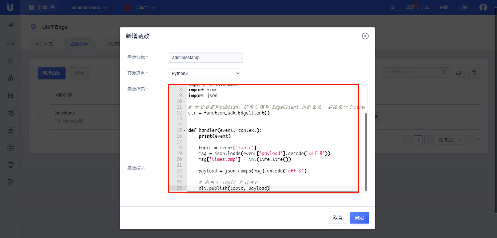
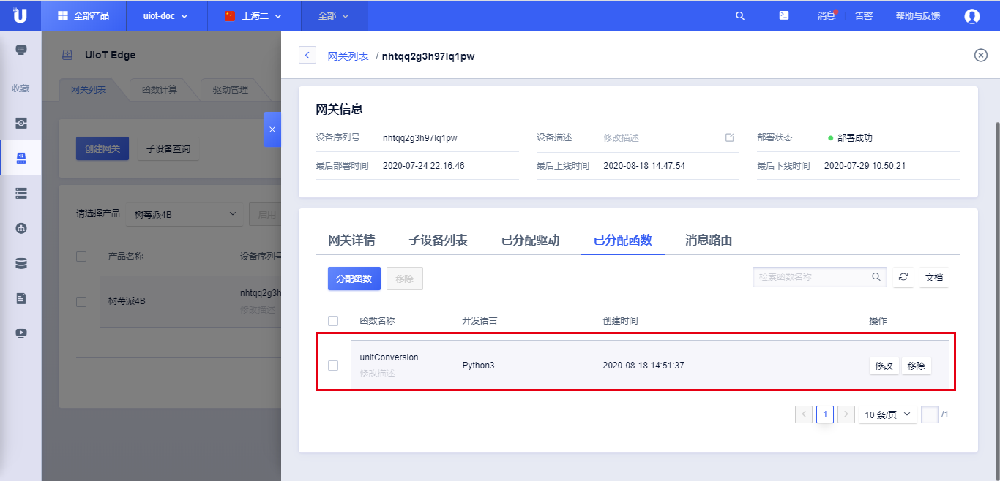
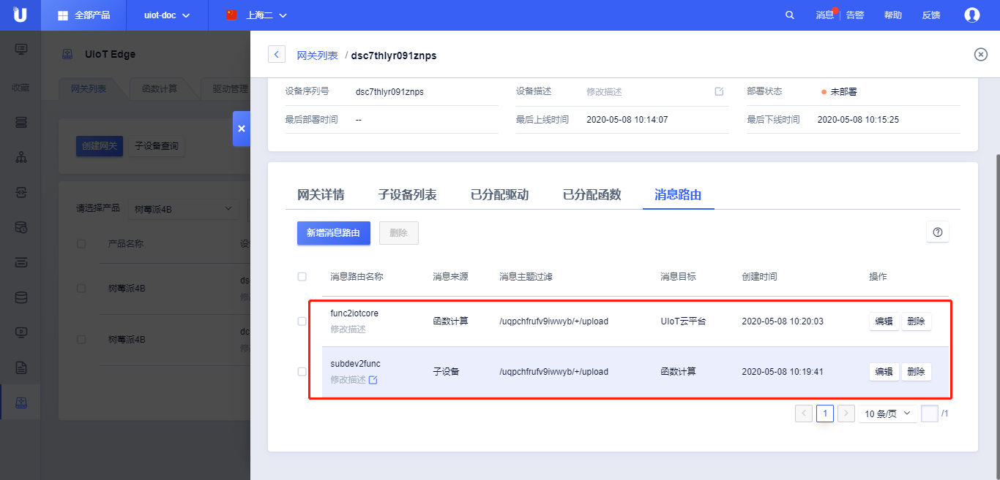
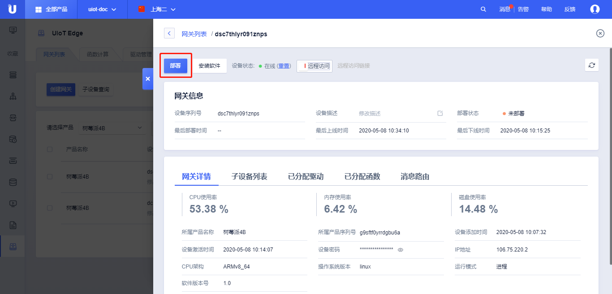
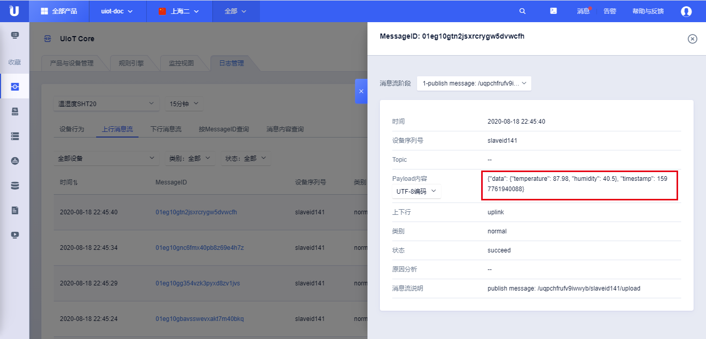

# 基于官方Modbus RTU驱动获取传感器温湿度

本节将以一个完整的例子详细介绍如何基于UIoT Edge，通过子设备驱动、函数计算、消息路由完成传感器温湿度的数据采集以及添加函数计算，并完成传感器数据上云。

本实践分为两个部分：

- 采集温湿度数据；
- 设置温湿度修正值；

## 系统架构



## 准备条件

1. 传感器设备：温湿度传感器SHT20，485接口 ，使用Modbus RTU
2. 网关设备：树莓派4B（ubuntu 64bit） + USB转485
3. 云服务器：UHost，接收数据，下发数据
4. UIoT Edge：创建UIoT Edge边缘网关产品，使用官方Modbus驱动

## 传感器相关参数

#### 1. 485连接参数：

   - 串口设备：/dev/ttyUSB0
   - 波特率： 9600
   - 8位数据，1位停止，无校验 
#### 2. 获取温湿度Modbus命令

   - **主机读取温度和湿度命令帧(0x04)** ：

| 从机地址 | 功能码 | 寄存器地址高字节 | 寄存器地址低字节 | 寄存器数量高字节 | 寄存器数量低字节 | CRC高字节 | CRC低字节 |
| -------- | ------ | ---------------- | ---------------- | ---------------- | ---------------- | --------- | --------- |
| 0x01     | 0x04   | 0x00             | 0x01             | 0x00             | 0x02             | 0x20      | 0x0B      |

   **从机响应数据帧：**

| 从机地址 | 功能码 | 字节数 | 温度高字节 | 温度低字节 | 湿度高字节 | 湿度低字节 | CRC高字节 | CRC低字节 |
| -------- | ------ | ------ | ---------- | ---------- | ---------- | ---------- | --------- | --------- |
| 0x01     | 0x04   | 0x04   | 0x01       | 0x31       | 0x02       | 0x22       | 0x2A      | 0xCE      |


   温度值=0x131,转换成十进制305，实际温度值= 305 / 10 = 30.5℃

   湿度值=0x222，转换成十进制546，实际湿度值=546 / 10 = 54.6%；

   > **注：温度是有符号**, 16进制数，温度值=**0xFF33**，转换成十进制 **-205**，实际温度= **-20.5℃**；


#### 3. 修改温湿度修正值

   - **修改温度修正值命令帧(0x06)** ：

| 从机地址 | 功能码 | 寄存器地址高字节 | 寄存器地址低字节 | 寄存器值高字节 | 寄存器值低字节 | CRC高字节 | CRC低字节 |
| -------- | ------ | ---------------- | ---------------- | -------------- | -------------- | --------- | --------- |
| 0x01     | 0x06   | 0x01             | 0x03             | 0x00           | 0x01           | 0xB9      | 0xF6      |

   **从机响应数据帧：**

| 从机地址 | 功能码 | 寄存器地址高字节 | 寄存器地址低字节 | 寄存器值高字节 | 寄存器值低字节 | CRC高字节 | CRC低字节 |
| -------- | ------ | ---------------- | ---------------- | -------------- | -------------- | --------- | --------- |
| 0x01     | 0x06   | 0x01             | 0x03             | 0x00           | 0x01           | 0xB9      | 0xF6      |

   - **修改湿度修正值命令帧(0x06)**：

| 从机地址 | 功能码 | 寄存器地址高字节 | 寄存器地址低字节 | 寄存器值高字节 | 寄存器值低字节 | CRC高字节 | CRC低字节 |
| -------- | ------ | ---------------- | ---------------- | -------------- | -------------- | --------- | --------- |
| 0x01     | 0x04   | 0x01             | 0x04             | 0x00           | 0x01           | 0x08      | 0x37      |

**从机响应数据帧：**

| 从机地址 | 功能码 | 寄存器地址高字节 | 寄存器地址低字节 | 寄存器值高字节 | 寄存器值低字节 | CRC高字节 | CRC低字节 |
| -------- | ------ | ---------------- | ---------------- | -------------- | -------------- | --------- | --------- |
| 0x01     | 0x04   | 0x01             | 0x04             | 0x00           | 0x01           | 0x08      | 0x37      |

   - **连续修改温度和湿度修正值命令帧(0x10)**：

| 从机地址 | 功能码 | 起始地址高字节 | 起始地址低字节 | 寄存器数量高字节 | 寄存器数量低字节 | 字节数 | 寄存器1值高字节 | 寄存器1值低字节 | 寄存器2值高字节 | 寄存器2值低字节 | CRC高字节 | CRC低字节 |
| -------- | ------ | -------------- | -------------- | ---------------- | ---------------- | ------ | --------------- | --------------- | --------------- | --------------- | --------- | --------- |
| 0x01     | 0x10   | 0x01           | 0x03           | 0x00             | 0x02             | 0x04   | 0x00            | 0x01            | 0x00            | 0x01            | 0x2E      | 0x2A      |

**从机响应数据帧：**

| 从机地址 | 功能码 | 寄存器地址高字节 | 寄存器地址低字节 | 寄存器数量高字节 | 寄存器数量低字节 | CRC高字节 | CRC低字节 |
| -------- | ------ | ---------------- | ---------------- | ---------------- | ---------------- | --------- | --------- |
| 0x01     | 0x10   | 0x01             | 0x03             | 0x00             | 0x02             | 0xB0      | 0x34      |

#### 4. 数据采集方式及上报格式

- 采集方式：轮询，间隔5s；

- 温湿度上报格式：

  ```json
  {
  	"data": {
  		"temperature": 27.5,
  		"humidity": 65
  	}
  }
  ```

  

- 下发修正值payload：

  修改修正值支持两种方式：
  
  - 依次修改温度修正值、湿度修正值
  
  ```json
  {
  	"data": {
  		"temperature_fix": 1,
  		"humidity_fix": -1
  	}
  }
  ```
  
  - 同时修改温度修正值和湿度修正值
  
  ```json
  {
  	"data": {
  		"temp_humi_fix": [1, -1]
  	}
  }
  ```
  
  
  
- 上下行Topic

  ```
  上行Topic：
  /${ProductSN}/${DeviceSN}/upload
  ```
  
  

## 操作步骤

1. 登录进入UCloud[物联网平台](https://console.ucloud.cn/uiot)

2. 参考[创建网关及子设备](/uiot-edge/user_guide/edge_subdevice/create_edge)，创建UIoT Edge产品，用于安装Edge软件

   - 创建网关产品：树莓派4B；创建网关设备：5e09q6vlz2vgbkwv；
   - 创建子设备产品：SHT20；创建子设备设备：zbrnklpv9qqtzrtx；
   - 将创建的子设备zbrnklpv9qqtzrtx绑定到网关设备5e09q6vlz2vgbkwv下；

   

   

   

3. 参考[安装软件](/uiot-edge/user_guide/install/runtime_install)，在树莓派上安装UIoT Edge运行时

   - 选择需要安装的目录，运行安装脚本进行安装：

     ```bash
     curl -O http://uiotcore-edge.cn-sh2.ufileos.com/ucloud_iot_edge_process_proc.sh && chmod +x ucloud_iot_edge_process_proc.sh && ./ucloud_iot_edge_process_proc.sh --install ARMv8_64 1.0 && ./ucloud_iot_edge_process_proc.sh --config 1pgf18ysv2w1g0dp kw4aud0zjcrdma39 pfa4vxglnwm9kez8 && ./ucloud_iot_edge_process_proc.sh --start
     ```
     

     
- 启动-停止UIoT Edge Runtime
  
  ```bash
     ./ucloud_iot_edge_process.sh --start
     ./ucloud_iot_edge_process.sh --stop
  ```
  
  
  





4. 分配官方驱动，并进行驱动配置、子设备绑定、子设备配置，由于**本实践基于官方modbus驱动**，配置文件编写参考章节[官方Modbus驱动](/uiot-edge/edge_development/subdev_driver_SDK/offical_modbus_driver)

   - 驱动配置

     - 配置action为读输入寄存器，分别以data.temperature，data.humidity的json字段格式上报；
     
     - 配置action为写保持寄存器，写入data.temperature_fix，data.humidity_fix，data.temp_humi_fix下发的值；
     
     ```json
     {
         "channel": {
             "port": "/dev/ttyUSB0",
             "baudrate": 9600,
             "method": "rtu"
         },
         "sensor1": {
             "read": [
                 {
                     "action": "input_registers",
                     "address": "0x0001",
                     "number": 2,    //读取两个寄存器
                     "prop_list": [
                         {
                             "name": "data.temperature",
                             "type": "int",
                             "count": 1,  //返回的第一个寄存器值
                             "scale": 0.1,
                             "offset": 0
                         },
                         {
                             "name": "data.humidity",
                             "type": "int",
                             "count": 1,  //返回的第二个寄存器值
                             "scale":0.1,
                             "offset":0
                         }
                     ]
                 }
             ],
             "write": {
                 "data.temperature_fix": {
                     "action": "register",
                     "address": "0x0103"
                 },
                 "data.humidity_fix": {
                     "action": "register",
                     "address": "0x0104"
                 },
                 "data.temp_humi_fix": {
                     "action": "registers",
                     "address": "0x0103"
                 }
             },
             "topic": "/{}/{}/upload",
             "mode": "cycle"
         }
     }
     ```
     
     
     
- 子设备配置
  
  - 配置当前子设备使用的channel值；
         
     - 配置所属config类型；
     - 配置slave address；
     - 配置为轮询方式，周期为5秒；
     
     ```json
     {
     	"channel": "channel",
     	"config": "sensor1",
     	"slave_address": "0x01"
     }
     ```
     
     
  
5. 参考[函数开发及添加](/uiot-edge/user_guide/edge_computing/function_development)，编写函数计算，为payload添加时间戳
   
	
   ```python
   #!/usr/bin/env python
   # -*- coding:utf-8 -*-
   """
   function to add timestamp to json body, then send the message
   """
   
   import function_sdk
   import time
   import json
   
   # 如果要使用publish，需要先调用 EdgeClient 构造函数，初始化一个client
   cli = function_sdk.EdgeClient()
   
   
   def handler(event, context):
       print(event)
       
       topic = event['topic']
       msg = json.loads(event['payload'].decode('utf-8'))
       msg['timestamp'] = int(time.time())
       
       payload = json.dumps(msg).encode('utf-8')
       
       # 向指定 topic 发送消息
       cli.publish(topic, payload)
   ```
   
   

   

6. 参考[设置消息路由](/uiot-edge/user_guide/message_route/overview)，添加消息路由转发数据到云端

   - 路由一：子设备 -> 函数计算
   - 路由二：函数计算->云平台（IoT Core）

   

7. 部署上述所有改动

   

8. 查看子设备上报日志

   


