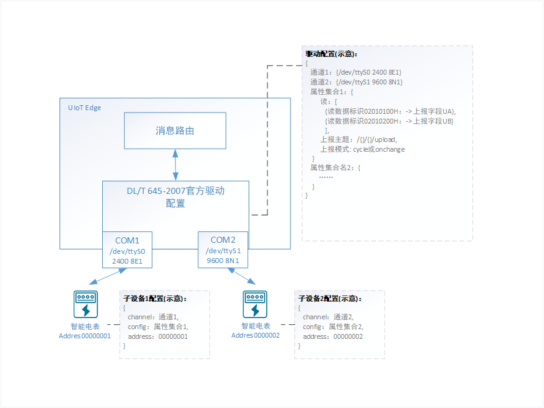
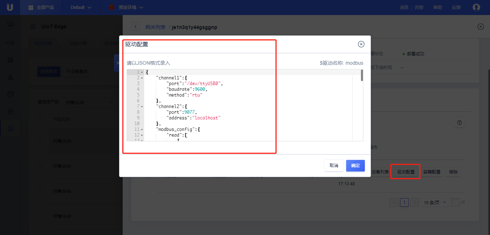
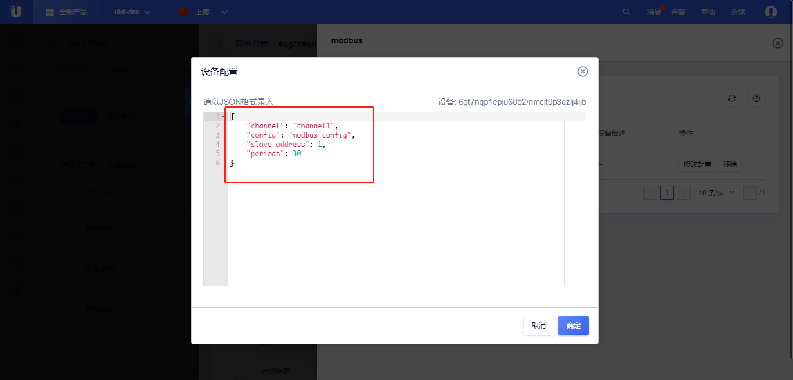

# 官方DL/T 645-2007驱动（C语言）

DL/T 645-2007是中国电力行业标准，是一种多功能电能表通信协议，该协议统一和规范了多功能电能表与数据终端设备进行数据交换时的连接方式和报文格式。

DL/T 645官方驱动目前支持数据的读取，用户通过自定义数据标识编码获取相应的参数值。需要写操作请联系在线客户或提工单咨询。

官方DLT/645 驱动基于RS-485 标准串行电气接口编写，用户仅需配置数据表示编码及读取数据格式即可获取相应的监测数据。


## 官方驱动配置文件详解

使用官方DL/T 645驱动需要进行【驱动配置】和【子设备配置】。

【驱动配置】：配置通道信息（/dev/ttyS0,9600,8N1 ...）、属性集合，对应DLT/645数据标识编码和上报json字段。

【子设备配置】：配置子设备所在通道及使用的属性集合。



### 驱动配置

#### 配置文件示例

```json
    {
        "channel": {
            "ttyUSB0": {
                "port": "/dev/ttyUSB0",
                "baudrate": 2400,
                "preamble": true,
                "period": 6,
                "time_wait": 0.07,
                "timeout": 8
            }
        },
        "dlt645_config": {
            "read": [
                {
                    "code": "00010000H",
                    "format": "XXXXXX.XX",
                    "name": "data.PAE"
                },
                {
                    "code": "02010100H",
                    "format": "XXX.X",
                    "name": "data.UA"
                },
                {
                    "code": "02020100H",
                    "format": "XXX.XXX",
                    "name": "data.IA"
                }
            ],
            "timestamp": true,
            "topic": "/{}/{}/upload",
            "mode": "cycle"
        }
    }
```

- channel: { channel1，channel2, ... } 表示不同的通道，名称可以自定义。
  
  - port：必填，使用串口设备，例如 "/dev/ttyS0"
  - baudrate：必填，串口波特率
  - bytesize：数据位长度，默认为8
  - parity：奇偶校验位，N - 不校验；O - 奇校验； E - 偶校验；M - 标记；S - 空间；默认为'E'
  - stopbits：停止位长度，默认为1
  - preamble：选填，true/false，发送报文是否需要包含前导符（4个FEH）
  - timtout：DLT645同一帧，设备响应的超时时间，单位为秒，支持小数，默认为3
  - time_wait：DLT645请求数据帧与帧之间的间隔时间，单位为秒，支持小数，默认为0.1
  - period：属性上报时间周期，单位为秒，支持小数，默认为30
    
  
- dlt645_config表示属性集合配置，名称自定义

  - read：选填，定义需要读取的寄存器值并转换成json上报数据包，该项为数组

    - code：必填，数据表示编码，四字节十六进制，比如正向有功总电能，格式为**“00010000H”**
    - formate：必填，数据格式，比如**“XXXXXX.XX”**
  - name：必填，自定义jsonpath或者`-`，代表数据上报到云端如何组成json包；
  - timestamp: 选填，true/false，上报数据是否带时间戳，时间戳为Unix时间戳，默认值为true
  - topic：必填，定义上报消息使用的topic，topic格式为”/{}/{}/xxx“，该Topic可以为系统Topic、自定义Topic、网关本地Topic
  - mode：必填，采集数据模式，轮询模式 - “cycle”或者变化上报模式 - “onchange”，

#### 驱动转换后的数据格式

- 上行

  ```json
  // 上报数据根据name的json path进行组包上报数据
  {
  	"data": {
  		"PAE":9873.34,
  		"UA":250.1,
          "IA":3.012
  	}
      "timestamp": 1597026387
  }
  ```

### 子设备配置

#### 子设备配置示例

```json
{
    "channel":"ttyUSB0",
    "config":"dlt645_config",
    "address":123456780018
}
```

- channel：必填，选择使用驱动配置中的哪个通道
- config：必填，选择使用驱动配置中的那个属性集合
- address：必填，设置该子设备的地址，实际BCD码地址

### 实践

了解了【驱动配置】和【子设备配置】，用户可以基于官方DL/T 645-2007驱动来采集UIoT Edge的表计设备。

## 官方驱动使用流程

1. [参考分配驱动](/uiot-edge/user_guide/subdevice_driver_access/driver_allocate)分配官方驱动到当前网关

   点击<已分配驱动> ，点击<分配驱动>，选择<官方>，选择<dlt645>，点击<分配>，点击<关闭>

   

2. 修改驱动配置

   点击<驱动配置>

   

3. 修改子设备配置

   点击<设备列表>，点击<添加设备>，点击<当前网关绑定设备>或<更多设备>，选中<子设备>，点击<确定>，点击<修改配置>。

   配置完驱动配置或者子设备配置，子设备即可通过官方dlt645驱动接入。

   