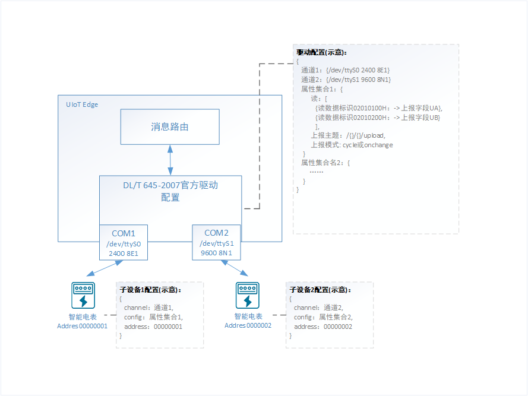

# 官方DL/T 645-2007驱动（C语言）

DL/T 645-2007是中国电力行业标准，是一种多功能电能表通信协议，该统一和规范了多功能电能表与数据终端设备进行数据交换时的物理连接和协议。

DL/T 645官方驱动目前支持数据的读取，用户通过自定义数据标识编码获取相应的参数值。需要写操作请联系在线客户或提工单咨询。

官方DLT/645 驱动基于RS-485 标准串行电气接口编写，用户仅需配置数据表示编码及读取数据格式即可获取相应的监测数据。

## 官方驱动配置文件详解

使用官方DL/T 645驱动需要进行【驱动配置】和【子设备配置】。

【驱动配置】：配置通道信息（/dev/ttyS0,9600,8N1 ...）、属性集合，对应DLT/645数据标识编码和上报json字段。

【子设备配置】：配置子设备所在通道及使用的属性集合。

### 驱动配置

#### 配置文件示例