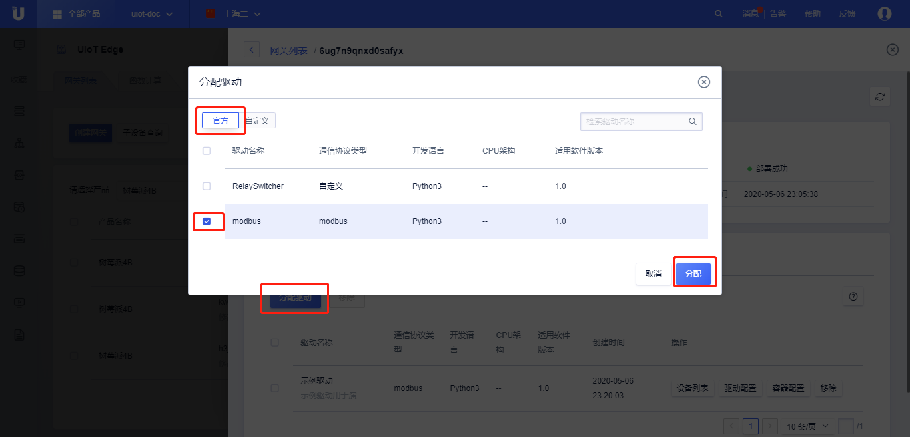
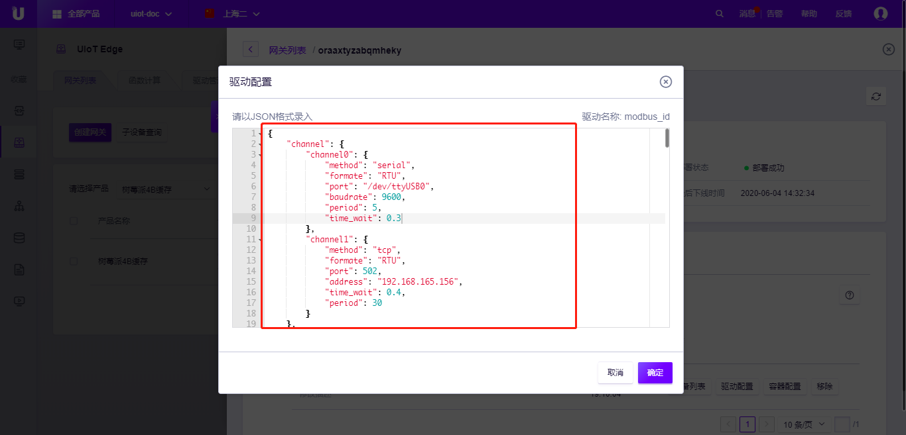

# 官方Modbus驱动

[Modbus](http://www.modbus.org/tech.php)最早由Modicon公司（现在的施耐德电气 ）于1979年为使用可编程逻辑控制器（PLC）通信而发表。Modbus已经成为工业、能源、楼宇、农业领域通信协议的业界标准，目前是工业电子设备之间常用的连接方式。

Modbus官方驱动目前支持Modbus RTU和Modbus TCP两种模式。


**Modbus 官方驱动支持以下功能：**

- 支持配置多通道、多传感器数据采集
- 支持通过自定义Topic上报数据，数据格式支持自定义json
- 支持周期性上报（cycle）和数据变化上报（onchange）
- 支持设置上报周期，默认是30秒
- 支持连续读写多个寄存器
- 支持Modbus功能码：
  - 02H 读离散输入寄存器(1x)
  - 04H 读输入寄存器(3x)
  - 01H 读线圈寄存器(0x)
  - 05H 写单个线圈寄存器(0x)
  - 03H 读保持寄存器(4x)
  - 06H 写单个保持寄存器(4x)
  - 10H 写多个保持寄存器(4x)


## 官方驱动配置文件详解

使用官方Modbus驱动需要进行【驱动配置】和【子设备配置】。

【驱动配置】：配置通道信息（/dev/ttyS0,9600,8N1 ...）、属性集合，对应Modbus命令和上报json字段。

【子设备配置】：配置子设备所在通道及使用的属性集合。


### 驱动配置

#### 配置文件示例

```json
{
    "channel1":{
        "port":"/dev/ttyUSB0",
        "baudrate":9600,
        "method":"rtu"
    },
    "channel2":{
        "port":9077,
        "address":"localhost",
        "method":"tcp"
    },
    "modbus_config":{
        "read":[
            {
                "action":"coils",
                "address":"0x0001",
                "number":1,
                "prop_list":[
                    {
                        "name":"data.coil1",
                        "count":1
                    }
                ]
            },
            {
                "action":"input_registers",
                "address":"0x0003",
                "number":1,
                "prop_list":[
                    {
                        "name":"data.input_register",
                        "count":1,
                        "type": "int",
                        "count": 1,
                        "scale": 0.1,
                        "offset": 0.0,
                        "swap16": true,
                        "swap32": false
                    }
                ]
            },
            {
                "action":"discrete_inputs",
                "address":"0x0001",
                "number":4,
                "prop_list":[
                    {
                        "name":"device.input1",
                        "count":1
                    },
                    {
                        "name":"device.input2",
                        "count":1
                    },
                    {
                        "name":"device.input3",
                        "count":1
                    },
                    {
                        "name":"device.input4",
                        "count":1
                    }
                ]
            }
        ],
        "write":{
            "device.coil1":{
                "action":"coil",
                "address":"0x0001"
            },
            "device.coil2":{
                "action":"register",
                "address":"0x0002"
            },
            "device.coil1_coil2":{
                "action":"coils",
                "address":"0x0001"
            }
        },
        "topic":"/{}/{}/upload",
        "mode":"cycle"
    }
}
```

- channel1，channel2 表示不同的通道的自定义名称，支持Modbus RTU和Modbus TCP
  - port：必填，RTU - 串口设备；TCP - 网络关口
  - baudrate：RTU 必填，串口波特率
  - method：必填，RTU - "rtu"，TCP - "tcp"

- modbus_config 表示属性集合配置，名称自定义

  - read：选填，定义需要读取的寄存器值并转换成json上报数据包，该项为数组

    - action：必填，读功能码，"coils" - 01H，"discrete_inputs" - 02H，"holding_registers" - 03H，"input_registers" -  04H

    - address：必填，读寄存器地址

    - number：必填，读寄存器个数。number=1，代表读一个16bit数据

    - prop_list：必填，设置modbus与json的对应关系，prop_list为数组，按先后顺序根据count值决定读取第几个寄存器或第几个位

      - type：必填，json组包时的上报类型，支持int，uint，float，float64，string，默认为 TODO

      - name：选填，自定义jsonpath，代表数据上报到云端如何组成json包；当该字段为空，但count不为空时，代表跳过该寄存器或该bit位，
      - count：必填，默认值为1
      - scale：选填，缩放系数，将读取的值乘以scale上报
      - offset：选填，偏移系数，将读取的值加offset上报
      - swap16：选填，true/false，修改大小端，是否交换寄存器的高8位和低8位后再换算
      - swap32：选填，true/false，修改大小端，当寄存器count=2时，是否交换两个寄存器的数据后再换算
  - write：选填，定义写入寄存器值和下行json数据包对应的关系，该项为数组
      - device.coil1,device.coil2,device.coil1_coil2为jsonpath，用户根据自己需要组包的json的格式自定义
      - action：必填，写功能码，"coil" - 05H，"coils" - 0FH，"register" - 06H，"registers" - 10H
      - address：必填，写寄存器地址
  - topic：必填，定义上报消息使用的topic，topic格式为”/{}/{}/xxx“，该Topic可以为系统Topic、自定义Topic、网关本地Topic
  - mode：必填，采集数据模式，轮询模式 - “cycle”或者变化上报模式 - “onchange”，

#### 驱动转换后的数据格式

- 上行

  ```json
  {
  	"data": {
  		"coil1": true,
  		"input_register": 10
  	},
  	"device": {
  		"input1": true,
  		"input2": true,
  		"input3": true,
  		"input4": true
  	}
  }
  ```

  

- 下行

  ```json
  //写单个
  {
  	"device": {
  		"coil1": true,
  		"coil2": true
  	}
  }
  //写多个
  {
  	"device": {
  		"coil1_coil2": [true, false]
  	}
  }
  ```

  

### 子设备配置

#### 子设备配置示例

```json
{
    "channel":"channel1",
    "config":"modbus_config",
    "slave_address":1,
    "periods":30
}
```

- channel：必填，选择使用驱动配置中的哪个通道
- config：必填，选择使用驱动配置中的那个属性集合
- slave_address：必填，设置该子设备的从地址
- periods：必填，上报周期

### 实践

了解了【驱动配置】和【子设备配置】，用户可以基于官方Modbus采集UIoT Edge的Modbus设备。

更多使用示例可以参考[最佳实践]()。

## 官方驱动使用流程

1. [参考分配驱动]()分配官方驱动到当前网关

   点击<已分配驱动> ，点击<分配驱动>，选择<官方>，选择<modbus>，点击<分配>，点击<关闭>

   

2. 修改驱动配置

   点击<驱动配置>

   

3. 修改子设备配置

   点击<设备列表>，点击<添加设备>，点击<当前网关绑定设备>或<更多设备>，选中<子设备>，点击<确定>，点击<修改配置>。

   配置完驱动配置或者子设备配置，子设备即可通过官方Modbus驱动接入。

   