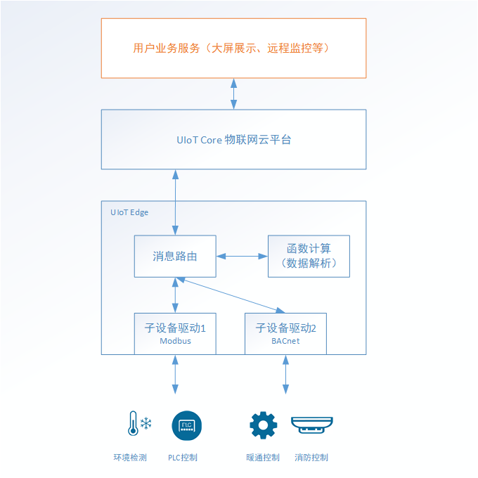

# 什么是物联网边缘网关

## 产品介绍

UCloud 物联网边缘网关（UCloud IoT Edge）是 UCloud 物联网通信云平台在边缘端的延伸。物联网边缘网关可以实现子设备的数据采集，数据的解析、清洗、加工、聚合、缓存，现场实时控制，本地场景联动等。

物联网边缘网关提供边缘子设备接入、函数计算、消息路由、本地缓存断网续传、远程SSH运维等功能，可以广泛应用于智慧社区、智慧楼宇、工业制造、智慧能源、智慧农业等领域。

## 产品优势

##### 多行业协议方便接入

UIoT Edge 提供子设备协议接入框架，也叫子设备驱动。子设备驱动框架定义了子设备挂到网关上后的一系列功能实现机制，包括设备上下线、设备配置、协议解析、上报消息、下行控制。用户可以基于该框架适配各行业下的协议适配，目前UIoT Edge官方支持Modbus协议，其他领域的协议，用户可以参考[驱动开发](/uiot-edge/user_guide/subdevice_driver_access/driver_development)文档进行编写。

##### 云边协同快速部署

云端配置，一键部署。不论是添加子设备、函数计算、消息路由还是配置子设备驱动都可以直接在云端完成，一键部署同步到边缘网关，实现云边协同。

##### 边缘端编排处理，实时控制

UIoT Edge 边缘网关支持函数计算，实时处理本地数据及消息事件，做到快速响应，有效避免因为网络抖动、网络中断等引起的控制延时或控制消息丢失。消息路由可以方便进行处理的灵活编排。

##### 上云数据清洗降低成本

边缘网关的函数计算功能可以对本地数据进行清洗、聚合处理，对设备上报的大量重复性数据进行清洗或者聚合后再上报到云端，节约上行流量，降低成本。数据清洗还可以对某些数据进行脱敏处理，实现非敏感数据的上云。

##### 本地缓存断网续传

对于消息路由目的地为IoT Core的数据，UIoT Edge 提供本地缓存机制，当网络出现中断时，数据自动缓存到本地，待网络恢复时再将消息上报到云端。

##### 全链路加密安全可靠

边缘网关继承了物联网云平台安全可靠的特点，数据上云采用端到端全链路加密，减少数据泄露风险。

## 核心功能

##### 边缘网关管理

提供边缘网关全生命周期管理，包括网关添加、激活、上线、离线、删除等。

##### 子设备管理及拓扑添加

提供子设备全生命周期管理，以及子设备绑定到网关。

##### 驱动管理

提供子设备驱动管理（版本、协议、开发语言、适用硬件架构），以及驱动分配到网关设备。

##### 函数计算

提供函数计算的管理，可以在线编辑函数逻辑，分配到边缘网关。

##### 消息路由

提供边缘网关侧子设备、函数计算、云平台三者之间的消息流转，数据分析处理的编排。

##### 远程SSH运维

提供远程运维，云端可以安全远程登录到边缘网关，管理网关设备。

## 适用场景

##### 工业场景实时控制，就近处理

在智慧工厂，各类机器安装有大量传感器，从传感器数据采集、数据解析、网络传输、云端业务处理、云端下发反向控制指令，再传回给工厂机器，路径很长，会有较明显延迟。边缘网关的消息路由、函数计算功能可以很好的实现本地实时控制、就近处理。

##### 数据清洗、聚合后上云，降低成本

智能制造、智慧楼宇、智慧城市等场景，传感器每时每刻产生大量的数据，这些数据有很多是重复冗余的，如果将这些数据都传输上云将是一笔不小的开销，而且也没有必要。边缘网关能够有效的对数据进行聚合、清洗，让有用、关键数据上云，降低成本。

##### 各类楼控、电气、工业协议快速接入

在楼宇控制领域、电气领域、工业领域，一些采集卡、DDC设备、PLC设备使用不同的行业协议，比如BACnet、Lonwork、Modbus、DeviceNet、ProfibusDP、EtherNet/IP，UIoT Edge提供一套完整的设备接入驱动框架，可以基于该框架完成设备的数据解析、数据上下线控制、数据上云。

##### 数据上云断网续传

在网络情况不好的情况下，UIoT Edge支持本地缓存，待网络恢复后将缓存的消息转发到云端，实现断网续传。

##### 网关设备子设备统一管理

网关设备和子设备对上层应用透明可见，应用对子设备的操作无需关注网关，网关仅仅是子设备的代理，子设备拥有独立的生命周期管理，拓扑结构清晰，管理一目了然。

## 业务架构

## 客户收益

##### 云边协同开发周期短

边缘侧提供完整的设备接入、协议解析框架、函数计算、消息路由等功能，用户部署之后直接使用，减少开发周期。

##### 本地数据脱敏聚合

消息路由可以灵活的配置子设备消息的数据流转方式，对于敏感数据可以经过函数计算做脱敏处理后上传到云端UIoT Core。

##### 硬件选配灵活

UIoT Edge提供一套完整的运行时，适配x86、arm架构，对硬件不做限制，用户可以自由选择合适的硬件安装部署。

##### 边缘应用扩展灵活

消息路由与函数计算，基于消息驱动，消息总线制，扩展灵活，自主可控。

