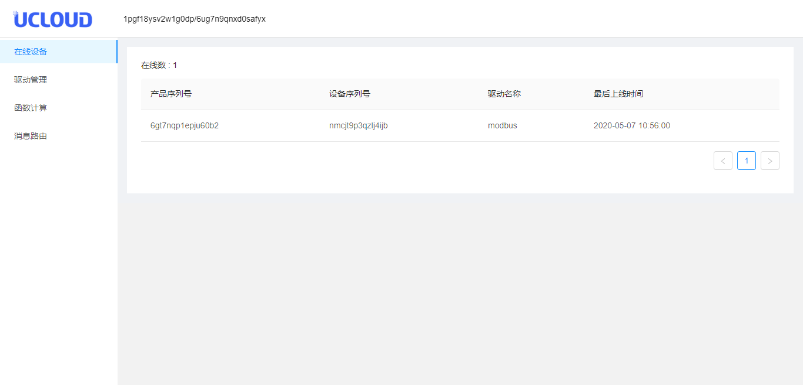
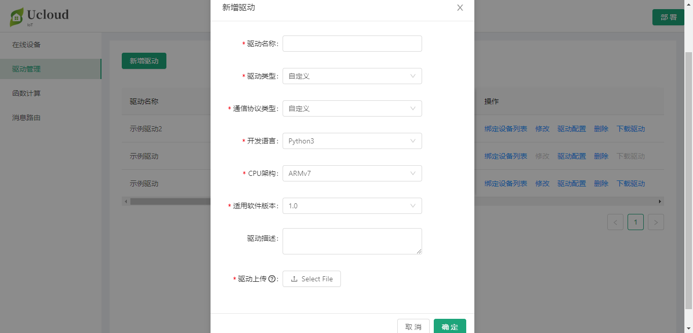
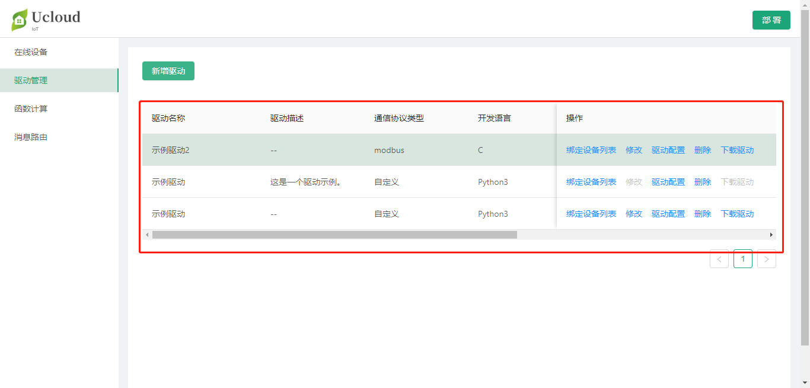
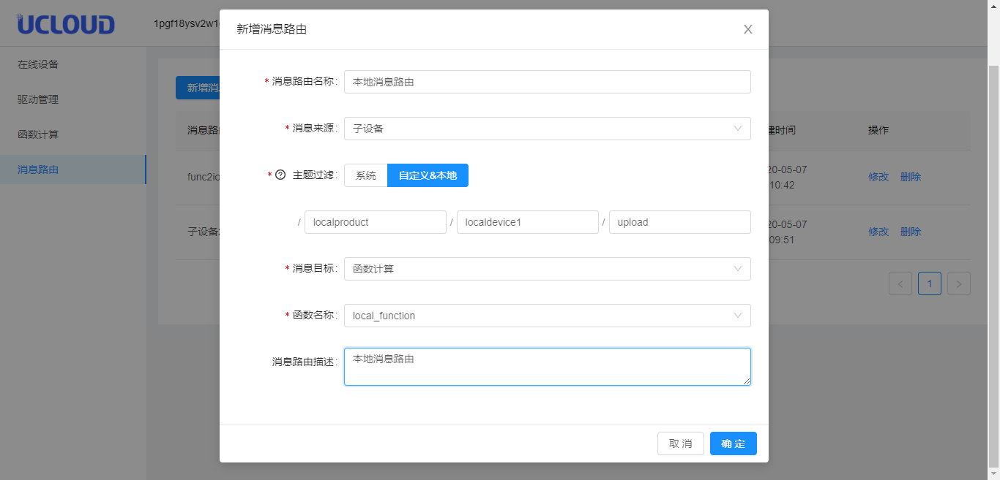
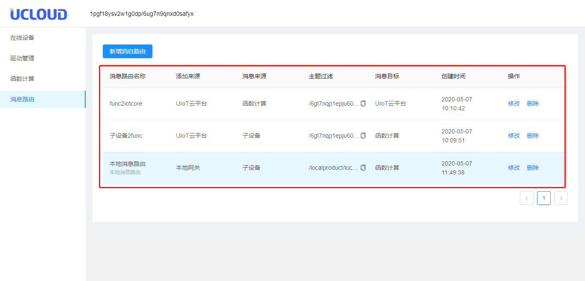

# 控制台详细操作

**本地控制台操作遵循的原则：**TODO

1. 云端控制台修改的内容可以通过部署同步到本地网关；
2. 本地网关的修改只能在本地有效，云端重新部署后会覆盖之前通过本地控制台添加的驱动、函数计算、消息路由；
3. 本地控制台驱动绑定的子设备，其产品序列号默认为`local`；
4. 本地消息路由添加的本地Topic只能在本地流转；
5. 本地控制台添加驱动、函数计算需要本地<部署>后才能生效，添加消息路由会立即生效；

## 管理在线设备

1. 登录本地控制台，http://ip:8080/admin；
2. 切换到<在线设备>标签；
3. 查看当前网关在线设备：
   - 产品序列号：当前在线设备的产品序列号；
   - 设备序列号：当前在线设备的设备序列号；

## 驱动管理

驱动管理可以查看云端部署到网关的驱动，同时也可以在本地新增驱动。驱动的编写规范参考[子设备驱动与接入](/uiot-edge/user_guide/subdevice_driver_access/overview)。

### 新增驱动

1. 登录本地控制台；
2. 切换到<驱动管理>标签；
3. 点击<新增驱动>，在弹出的新增驱动对话框中添加：
   - 驱动名称：该驱动的名称，TODO；
   - 驱动类型：自定义；
   - 通信协议类型：Modbus、WebSocket、自定义；
   - 开发语言：支持Python3和C；
   - CPU架构：ARMv7，ARMv8_64，X86_64；
   - 适用软件版本：是用于UIoT Edge运行时的哪个版本；
   - 驱动描述：关于该驱动的描述；
4. 点击<确定>，可以在驱动列表中查看新增的驱动；

### 驱动列表

驱动列表包括两类驱动：一类是本地新增的驱动；另一类是通过云端部署的驱动；

3. 查看**驱动列表**：
   - 驱动基本信息：包括驱动名称、驱动描述、通信协议类型、开发语言；
   - 操作：
     - 绑定设备列表：见第4步，修改云端绑定的设备配置信息，或新增local设备；
     - 修改：本地上传的驱动支持修改，云端部署的驱动不支持；TODO
     - 驱动配置：修改驱动配置文件，支持修改云端或本地；
     - 删除：删除该驱动；
     - 下载驱动：下载该驱动；

4. 绑定设备列表：

   - 子设备信息：包括产品序列号、设备序列号、绑定时间；

   - 操作：

     - 修改配置：修改驱动针对该子设备的配置；

     - 移除：移除该子设备，支持移除云端或本地添加的子设备；

   - 新增设备：绑定本地设备到驱动，设备序列号自行输入；TODO
   
   - 修改：修改本地添加的驱动，包括驱动名称、适用软件版本、驱动描述、上传驱动；

## 函数计算

函数计算可以查看云端部署到网关的函数计算，同时也可以在本地新增函数。函数的编写规范参考[函数开发及添加](/uiot-edge/user_guide/edge_computing/function_development)。

### 新增函数

1. 登录本地控制台；
2. 切换到<函数计算>标签；
3. 点击<新增函数>，在弹出的新增函数对话框中添加：
   - 函数名称：该函数的名称，函数计算是以函数名区分不同的函数，本地添加的函数如果函数名与云端相同，云端再次部署时会覆盖当前函数TODO；
   - 开发语言：支持Python3；
   - 函数代码：直接输入相应的函数代码；
   - 函数描述：关于该函数的描述；
4. 点击<确定>，可以在函数计算列表中查看新增的函数；

### 函数列表

函数列表包括两类：一类是本地新增的函数；另一类是通过云端部署的函数；

1. 查看**函数列表**：
   - 函数基本信息：包括函数名称、函数描述、开发语言、创建时间；
   - 操作：
     - 修改：本地上传的函数支持修改，云端部署的函数不支持；（TODO 3大功能好像不太同意）
     - 删除：删除该函数计算；

## 消息路由

消息路由可以查看云端部署到网关的消息路由规则，同时也可以在本地新增消息路由。消息路由的配置详解参考[消息路由配置详解](/uiot-edge/user_guide/message_route/route_config_detail)。消息路由本地添加成功后，即生效，无需重新部署；（TODO，这样设计不太合理，和规则引擎一样，最好有一个启用，禁用）

### 新增消息路由

1. 登录本地控制台；
2. 切换到<消息路由>标签；
3. 点击<新增消息路由>，在弹出的新增消息路由对话框中添加：
   - 消息路由名称：该消息路由的名称，消息路由名称不能重复TODO；
   - 消息来源：选择本地设备、UIoT Core、函数计算；
   - 消息过滤主题：填写消息过滤的主题。当消息来源或目标为UIoT Core时，需要配置为云端的Topic，并且子设备已经绑定到了本网关下；
   - 消息目标：选择本地设备、UIoT Core、函数计算；
   - 消息路由描述：关于该消息路由的描述；
4. 点击<确定>，可以在消息路由列表中查看新增的消息路由；

### 消息路由列表

消息路由列表包括两类：一类是本地新增的函数；另一类是通过云端部署的函数；

1. 查看**消息路由列表**：
   - 消息路由基本信息：包括消息路由名称、路由描述、消息来源、消息目标、消息过滤主题；
   - 操作：
     - 修改：修改该条规则；
     - 删除：删除该条规则；

