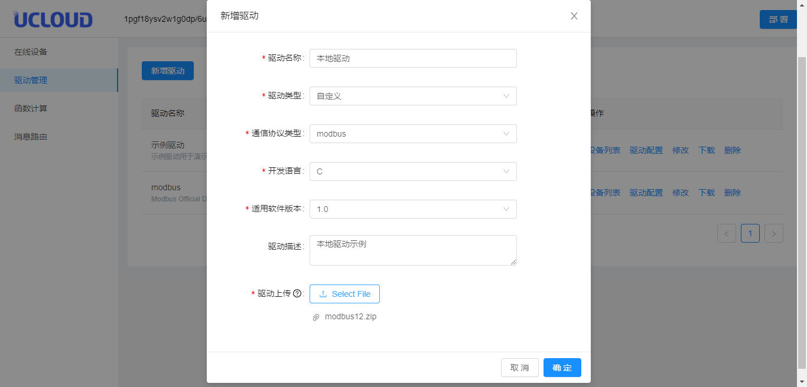
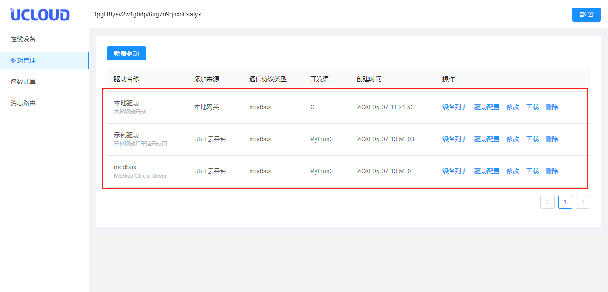
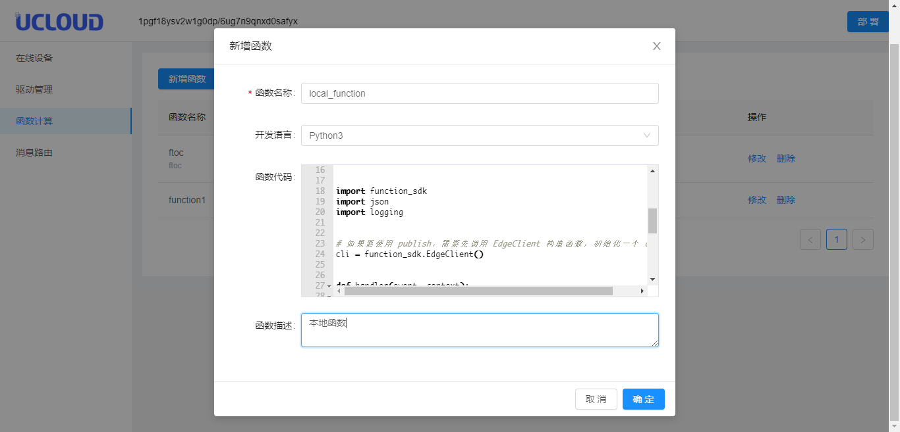
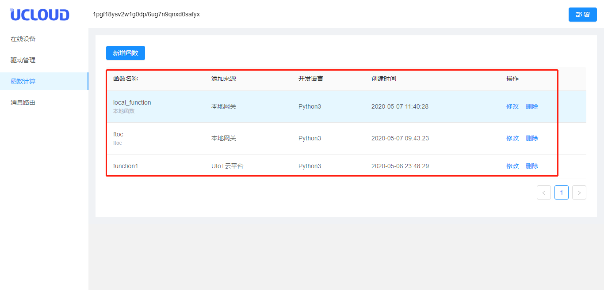

# 控制台详细操作

**本地控制台操作遵循的原则：**

1. 云端控制台修改的内容可以通过部署同步到本地网关；
2. 本地网关的修改只能在本地有效，云端重新部署后会覆盖和本地有冲突的设备驱动、函数计算、消息路由；
3. 本地控制台驱动绑定的子设备，需要手动输入`${ProdunctSN}/${DeviceSN}`，多条重复只生效一条；
4. 本地消息路由添加的本地Topic只能在本地流转；
5. 本地控制台添加驱动、函数计算需要本地<部署>后才能生效，添加消息路由会立即生效；

## 登录本地控制台

**登录本地控制台**
本地控制台访问地址：https://local-ip:8080
默认登录账号：admin 默认密码：uiotedge

**修改登录密码**
进入本地控制台后点击右上角账号名称（admin）选择修改密码
在弹窗中录入原密码 并输入新密码进行修改

## 管理在线设备

1. 登录本地控制台，切换到<在线设备>标签；
3. 查看当前网关在线设备：
   - 产品序列号：当前在线设备的产品序列号；
   - 设备序列号：当前在线设备的设备序列号；
   - 驱动名称：当前设备使用的驱动名称；
   - 最后上线时间：当前设备最后上线时间；

## 驱动管理

驱动管理可以查看云端部署到网关的驱动，同时也可以在本地新增驱动。驱动的编写规范参考[子设备驱动与接入](/uiot-edge/user_guide/subdevice_driver_access/overview)。

### 新增驱动

1. 登录本地控制台；
2. 切换到<驱动管理>标签；
3. 点击<新增驱动>，在弹出的新增驱动对话框中添加：
   - 驱动名称：该驱动的名称；
   - 驱动类型：自定义；
   - 通信协议类型：Modbus、WebSocket、自定义；
   - 开发语言：支持Python3和C；
   - 适用软件版本：适用于UIoT Edge运行时的哪个版本；
   - 驱动描述：关于该驱动的描述；
   - 驱动上传：上传驱动文件包；
4. 点击<确定>，可以在驱动列表中查看新增的驱动；

### 驱动列表

驱动列表包括两类驱动：一类是本地新增的驱动；另一类是通过云端部署的驱动；

1. 查看**驱动列表**：
   - 驱动基本信息：包括驱动名称、添加来源、通信协议类型、开发语言、创建时间；
   - 操作：
     - 设备列表：见第2步，修改云端下发的设备配置信息，或新增local设备；
     - 修改：修改驱动，包括驱动名称、适用软件版本、驱动描述、上传驱动，支持修改云端或本地；
     - 驱动配置：修改驱动配置文件，支持修改云端或本地；
     - 删除：删除该驱动；
     - 下载：下载该驱动；

4. 设备列表：

   - 子设备信息：包括产品序列号、设备序列号、绑定时间；

   - 操作：

     - 配置：修改驱动针对该子设备的配置；

     - 移除：移除该子设备，支持移除云端或本地添加的子设备；

   - 添加设备：绑定本地设备到驱动，设备产品序列号/序列号自行输入；
   

## 函数计算

函数计算可以查看云端部署到网关的函数计算，同时也可以在本地新增函数。函数的编写规范参考[函数开发及添加](/uiot-edge/user_guide/edge_computing/function_development)。

### 新增函数

1. 登录本地控制台；
2. 切换到<函数计算>标签；
3. 点击<新增函数>，在弹出的新增函数对话框中添加：
   - 函数名称：该函数的名称，函数名称支持英文字母大小写、数字、连接符和下划线，第一个字符只能以字母开头，最后一个字符不能为连接符或者下划线，名称长度2-31；
   - 开发语言：支持Python3；
   - 函数代码：直接输入相应的函数代码；
   - 函数描述：关于该函数的描述；
4. 点击<确定>，可以在函数计算列表中查看新增的函数；

### 函数列表

函数列表包括两类：一类是本地新增的函数；另一类是通过云端部署的函数；

1. 查看**函数列表**：
   - 函数基本信息：包括函数名称、添加来源、开发语言、创建时间；
   - 操作：
     - 修改：函数修改，支持修改本地和云端，云端的重新部署会失效；
     - 删除：删除该函数计算；

## 消息路由

消息路由可以查看云端部署到网关的消息路由规则，同时也可以在本地新增消息路由。消息路由的配置详解参考[消息路由配置详解](/uiot-edge/user_guide/message_route/route_config_detail)。消息路由本地添加成功后立即生效，无需重新部署；

### 新增消息路由

1. 登录本地控制台；
2. 切换到<消息路由>标签；
3. 点击<新增消息路由>，在弹出的新增消息路由对话框中添加：
   - 消息路由名称：该消息路由的名称，可包含中文、字母、数字、“_”的组合，4-32位字符（中文算1位）；
   - 消息来源：选择本地设备、UIoT Core、函数计算；
   - 消息过滤主题：填写消息过滤的主题。当消息来源或目标为UIoT Core时，需要配置为云端的Topic，并且子设备已经绑定到了本网关下；
   - 消息目标：选择本地设备、UIoT Core、函数计算；
   - 消息路由描述：关于该消息路由的描述；
4. 点击<确定>，可以在消息路由列表中查看新增的消息路由；

### 消息路由列表

消息路由列表包括两类：一类是本地新增的函数；另一类是通过云端部署的函数；

1. 查看**消息路由列表**：
   - 消息路由基本信息：包括消息路由名称、路由描述、消息来源、消息目标、消息过滤主题；
   - 操作：
     - 修改：修改该条规则；
     - 删除：删除该条规则；

## 日志设置
本地控制台可以对本地网关日志进行查看以及设置。具体操作如下

###查看本地日志

1. 登录本地控制台；
2. 切换到<本地日志>标签；
3. 在日志目录中找到所需的日志文件，打开后可查看日志内容。

###日志设置

1. 登录本地控制台；
2. 切换到<本地日志>标签；点击右上角<日志配置>进行配置

**配置说明**

1. 日志级别：可选[info]、[debug]、[warn]、[error]、四个级别，选择日志级别越低，日志记录信息越详情，占用日志空间越多。例：选择[info]级别日志会记录[info]、[debug]、[warn]、[error]四类信息。
2. 单服务日志数：可设置一个日志服务记录的文件数，默认一个日志文件为1MB。例：设置5个日志文件，单个服务会最多纪录5个日志文件，超过5个文件后会替换最早的日志文件。

