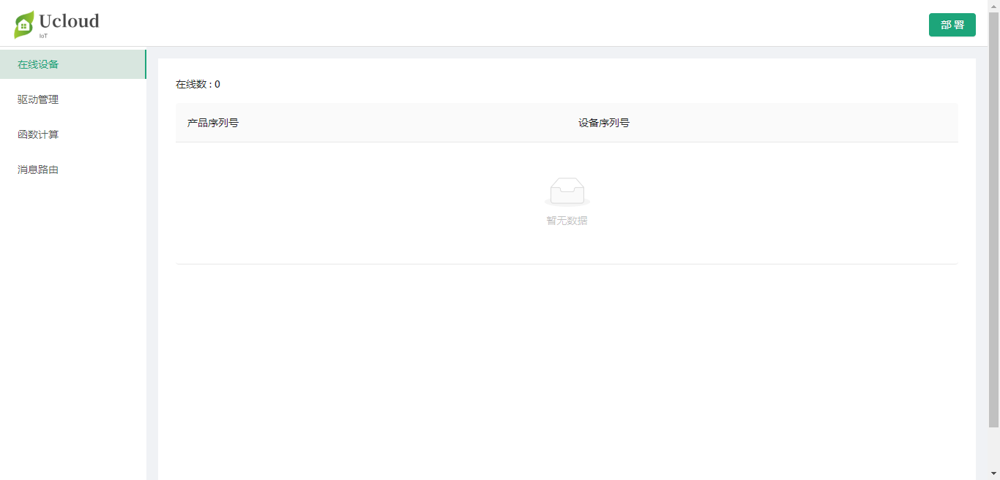

# 概览

UIoT Edge能够提供云边协同的能力，在云平台直接添加子设备驱动、函数计算、消息路由等资源，然后同步到相应的边缘网关。

同时对于某些不能联网的场景或希望临时本地快速修改的场景，边缘网关提供本地控制台管理网关的资源与配置：

- 在线设备查看：查看当前的在线设备，离线设备无法查看；
- 驱动管理：管理已经部署到网关的设备，支持本地添加，但不支持同步给云端；
- 函数计算：管理已经部署到网关的函数计算，支持本地添加，但不支持同步给云端；
- 消息路由：管理已经部署到网关的消息路由规则，支持本地添加，但不支持同步给云端；

**云端控制台和本地控制台的使用注意事项**

1. 云端控制台的修改（驱动、函数计算、消息路由）可以通过部署同步到网关；

2. 本地控制台的修改无法同步到云平台；

3. 本地控制台对驱动、函数计算、消息路由的修改在云平台重新部署后不再生效；TODO

   

## UIoT Edge本地控制台使用流程

1. 参考[安装软件]()，在目标硬件上安装UIoT Edge运行时；
2. 访问本地控制台，http://ip:8080/admin；
3. 本地管理边缘网关：[查看在线设备]()、[驱动管理]()、[函数计算修改]()、[消息路由修改]()；

