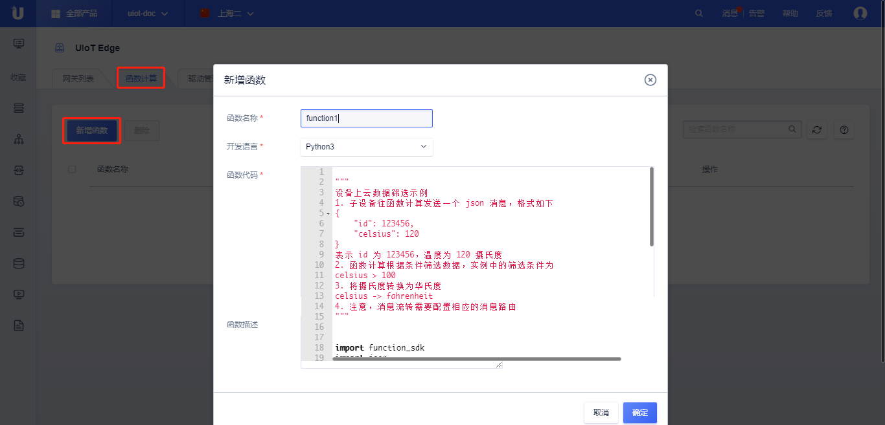

# 函数开发及添加

函数计算的开发目前仅支持Python3。函数计算基于消息触发模型完成消息的收发及业务处理。

## 函数开发

### 函数计算示例

本例完成当收到消息触发函数计算时，将收到的json数据包中的摄氏温度转换成华氏温度。

```python
"""
设备上云数据筛选示例
1. 子设备往函数计算发送一个 json 消息，格式如下
{
    "id": 123456,
    "celsius": 120
}
表示 id 为 123456，温度为 120 摄氏度
2. 函数计算根据条件筛选数据，示例中的筛选条件为
celsius > 100
3. 将摄氏度转换为华氏度
celsius -> fahrenheit
4. 注意，消息流转需要配置相应的消息路由
"""

import function_sdk
import json

# 如果要使用publish，需要先调用 EdgeClient 构造函数，初始化一个client
cli = function_sdk.EdgeClient()

def handler(event, context):
    try:
        msg = json.loads(event["payload"])
    except BaseException as err:
        print("json loads error:", err)
    # 筛选
    if msg["celsius"] > 100:
        # 使用原先的topic转发
        topic = event['topic']
        # 转换为华氏温标
        msg["fahrenheit"] = msg["celsius"] * 1.8 + 32
        try:
            payload = json.dumps(msg).encode('utf-8')
            # 向指定 topic 发送消息
            cli.publish(topic, payload)
        except BaseException as err:
            print("json dumps error:", err)
```


### 函数计算组成

#### 消息触发回调接口

基于函数计算的框架，用户只需实现`handler(event, context)`接口，当函数计算被消息路由命中时，handler接口会被调用，执行业务逻辑。

1. 函数接口名必须为`handler`；
2. 函数参数：
   - event：触发函数的事件，类型为 dict
|字段|类型|描述|
|-|-|-|
|type|String|事件类型，这里为 "mqtt"|
| topic   | String  | 消息topic                                                    |
| source  | String  | 消息来源，和消息路由一致。<br>分为"本地路由", "IoT Core云平台" 和 "函数计算" 三种 |
| payload | b:bytes | 消息体                                                       |
【示例】

```json
{
    'type': 'mqtt',
    'source': 'local',
    'topic': '/test/topic1',
    'payload': b'{"id":1, "celsius":150}'
}
```

   - context：函数上下文，类型为dict

| 字段             | 类型   | 描述           |
| ---------------- | ------ | -------------- |
| timestamp        | int    | 函数调用时间戳 |
| functionInvokeID | String | 函数调用ID     |
| functionName     | String | 函数名         |

【示例】

```json
{
    'timestamp': 1587886520,  //Unix时间戳
    'functionName': 'test1',
    'functionInvokeID': 'ac6cbf30-d9e7-4d50-8882-5b4648f6cfde'
}
```

#### 发送消息

发送消息只需构造一个`function_sdk.EdgeClient的对象，通过该对象的`publish`方法发送消息。

```python
cli = function_sdk.EdgeClient()
cli.publish(topic, payload)
```

#### 消息转发

函数计算消息转发需要通过[添加消息路由](/uiot-edge/user_guide/message_route/add_msg_route)来实现。函数计算将发送的消息流转到[消息路由](/uiot-edge/user_guide/message_route/overview)，消息路由根据配置的路由规则发送给指定目的地，比如，另一个函数计算、本地设备、物联网云平台。

## 添加函数

函数计算开发完成后，可以添加函数并进行测试：

- 将函数计算上传到函数管理，见本节[操作步骤](/uiot-edge/user_guide/edge_computing/function_development#操作步骤)；
- 通过下一节的[分配函数](/uiot-edge/user_guide/edge_computing/function_running#分配函数)，将函数计算分配给网关；
- [部署](/uiot-edge/user_guide/edge_computing/function_running#部署函数)后，进行测试、使用。

### 操作步骤

1. 登录进入UCloud[物联网边缘网关](https://console.ucloud.cn/uiot_edge)

2. 选择<函数计算>标签

3. 点击<新增函数>，在弹出的对话框中输入函数计算的相关信息

   - 函数名称：函数的名称，比如Hello_World；
   - 开发语言：选择开发语言，目前支持Python3；
   - 函数代码：函数实现代码，暂不支持打包上传；
   - 函数描述：对函数计算的描述；

4. 点击<确定>，添加**函数计算**成功；

5. 添加函数计算成功后，可以在函数计算列表中查看该函数

   - 基本信息：函数名称、函数描述、开发语言、创建时间等；
   - 操作：
     - 修改：对函数进行修改；
     - 删除：删除该函数计算；

6. <批量删除>：同时选择多个函数，点击<删除>按钮，可以批量删除函数；

   > **注：函数删除需要先移除函数与网关的分配关系，参考[分配函数](/uiot-edge/user_guide/edge_computing/function_running#分配函数)。**




