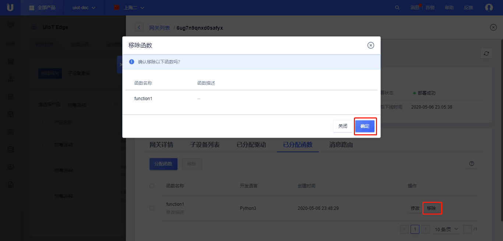

# 运行函数计算

## 分配函数

在上一节[函数开发及添加](/uiot-edge/user_guide/edge_computing/function_development)后，本节进行函数的分配和运行调试。

### 分配步骤

2. 登录进入UCloud[物联网边缘网关](https://console.ucloud.cn/uiot_edge)
2. 通过<请选择产品>，选择需要添加消息路由的网关设备
3. 选择相应的设备，点击<详情>，进入该边缘网关的管理界面
4. 选择<已分配函数>标签，点击<分配函数>，弹出的分配函数列表中
   - 函数名称：可用函数的名称
   - 函数描述：可用函数的描述
   - 开发语言：函数计算使用的开发语言
5. 选择需要分配给该网关的函数，点击<分配>，可以同时选中多个进行分配，分配完成后关闭该弹窗；
6. 可以看到已分配的函数列表
   - 函数基本信息：函数名称、函数描述、开发语言、分配时间
   - 操作：
     - <修改函数>：对该函数进行修改，该修改会影响函数计算管理中的该函数
     - <移除>：移除该函数

### 函数移除

函数移除支持移除单个函数和批量移除函数。

1. 单个移除：直接点击某个设备操作列的<移除>，可以移除单个分配函数；
2. 批量移除：同时选中多个设备，点击左上角<移除>，可以批量删除多个分配函数；

**函数移除注意事项：**

1. 移除函数后，可以重新分配；
2. 移除函数后需要重新部署才能生效；

## 部署函数

函数分配成功后，可以部署到网关侧进行测试运行。部署操作需要网关为**在线状态**。

### 部署步骤

1. 登录进入UCloud[物联网边缘网关](https://console.ucloud.cn/uiot_edge)
2. 通过<请选择产品>选择相应的边缘网关产品及边缘网关设备、点击<详情>，进入该边缘网关的管理界面；
3. 进入详情页后，点击<部署>，则会将更新部署到网关设备上
4. 查看**部署状态**为部署成功
5. 根据消息的上报情况，可以查看函数是否生效（需要另外配置[消息路由](/uiot-edge/user_guide/message_route/overview)）

