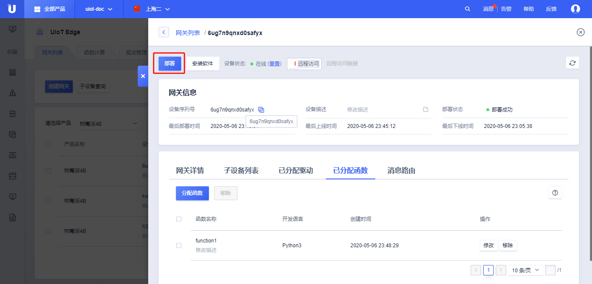
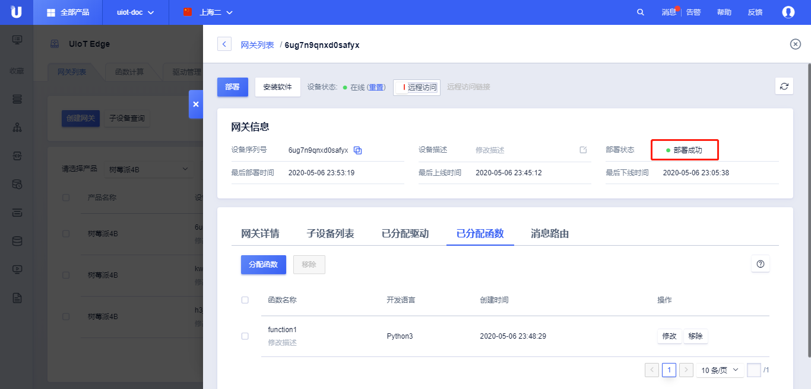

# 运行函数计算

## 分配函数

在上一节[函数开发及添加]()后，本节进行函数的分配和运行调试。

### 分配步骤

1. 登录进入UCloud[物联网平台](https://console.ucloud.cn/uiot)
2. 选择<网关管理>标签，点击<网关列表>，进入网关列表管理
3. 点击<请选择产品>，选择需要分配的网关产品
4. 选择相应的设备，点击<详情>，进入该网关的可分配资源管理界面
5. 选择<已分配函数>标签，点击<分配函数>，弹出的分配函数列表中
   - 函数名称：可用函数的名称；
   - 函数描述：可用函数的描述；
   - 开发语言：函数计算使用的开发语言；
6. 选择需要分配给该网关的函数，点击<分配>，可以同时选中多个进行分配，分配完成后关闭该弹窗；
7. 可以看到已分配的函数列表
   - 函数基本信息：函数名称、函数描述、开发语言、分配时间；
   - 操作：
     - <移除>：移除该函数；

### 函数移除

函数移除支持移除单个函数和批量移除函数。

1. 单个移除：直接点击某个设备操作列的<移除>，可以移除单个分配函数；
2. 批量移除：同时选中多个设备，点击左上角<移除>，可以批量删除多个分配函数；

**函数移除注意事项：**

1. 移除函数后，可以重新分配；
2. 移除函数后需要重新部署才能生效；

## 部署函数

函数分配成功后，可以部署到网关侧进行测试运行。部署操作需要网关为**在线状态**。

### 部署步骤

1. 登录进入UCloud[物联网平台](https://console.ucloud.cn/uiot)
2. 选择<网关管理>标签，点击<网关列表>，进入网关列表管理
3. 点击<请选择网关>，选择需要分配的网关产品
4. 选择相应的设备，点击<详情>，进入该网关的管理详情页
5. 点击<部署>，则会将所有分配资源发生的改动部署到网关设备上
6. 查看**部署状态**为部署成功

## 测试使用函数

函数测试有两种方法：

1. 本地测试，参考[网关本地控制台使用]()，TODO
2. 远程测试，参考[设置消息路由]()，配置消息到云端，查看设备数据上云情况，TODO

TODO:

