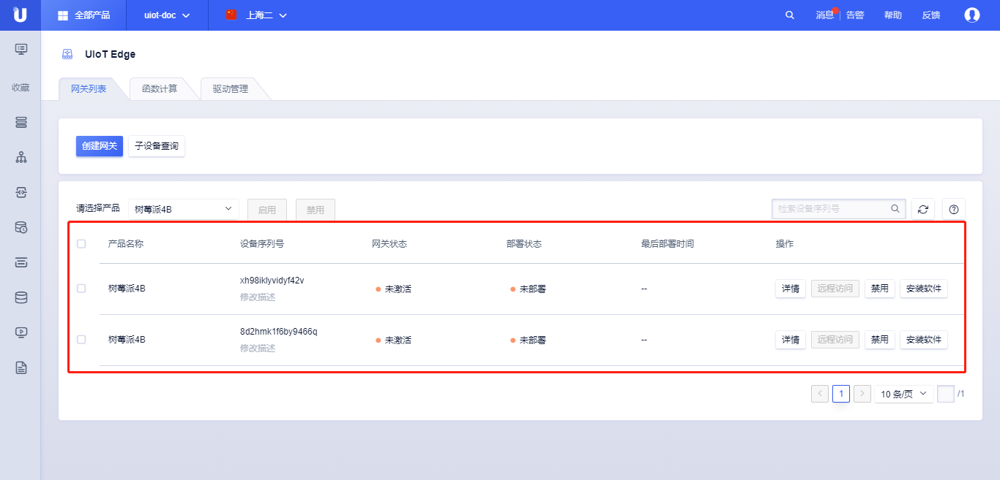

# 创建网关

UIoT Edge基于UCloud物联网通信云平台UIoT Core，用户可以参考UIoT Core物联网通信云平台了解相关的概念。物联网产品分为3类，普通产品、网关产品、子设备产品。

使用UIoT Edge需要先创建**网关产品**，然后在该产品下创建**网关设备**。每个网关设备可以独立地管理自己的子设备、子设备驱动、函数计算、消息路由等功能。

**网关产品**是一类特殊产品，除了普通产品的功能外，还有网关特有的功能，本节介绍了网关产品和普通产品相对应的功能，而网关的一些特殊功能在后续章节介绍。

## 创建网关

<创建网关>提供便捷的方式创建网关产品及网关设备。用户也可以参考UIoT Core物联网平台的[创建产品]()、[创建设备]()创建类型为【网关】的产品。

### 操作步骤 

1. 登录进入UCloud[物联网边缘网关](https://console.ucloud.cn/uiot_edge)
2. 选择<网关列表>标签，点击<创建网关>
3. 在弹出的对话框中点击<选择现有>或<新建网关产品>，选择网关设备
4. 选择<新建网关产品>
   - 产品名称：名称长度为4-32个字符，可包含中文、字母、数字、`_`、`-`、`@`、`:`的组合
   - 产品描述：支持任意字符，长度限制0-100个字符
   - 可以通过<随机生成>或<手动输入>创建设备
5. 点击<确定>，**创建网关及网关设备**成功
6. 创建网关设备成功后，可以在网关列表页查看创建的网关设备列表，并做相应的操作

### 网关详情

点击网关设备列表的<设备序列号>或者<详情>，可以对网关分配的驱动、函数计算、消息路由子设备等资源进行管理。

#### 网关详情

- <部署>：当发生**已分配驱动**、**已分配函数**、**消息路由**发生变化时，可点击部署，下发到网关

- <安装软件>：网关初次使用，需要安装UIoT Edge运行时，参考[安装网关软件]()

- <设备状态>：在线、离线、未激活

- <远程服务ON/OFF>：是否开启或关闭远程运维服务

  - <远程访问链接>：点击可以远程访问边缘网关

- 网关信息：

  - 设备基本信息：设备序列号、设备描述
  - 设备状态信息：部署状态、最后部署时间、最后上线时间、最后下线时间
  - 状态：网关设备的当前的状态，包括未激活、离线、在线、已禁用等状态

- 网关详情：

  - 网关系统使用情况：CPU使用率、内存使用率、磁盘使用率
  - 所属身份信息：所属产品名称、所属产品序列号、设备密码
  - 设备使用信息：设备添加时间、设备激活时间、IP地址
  - 设备软件信息：CPU架构、操作系统、运行模式、软件版本号

- 子设备列表：

  - <添加设备>：添加子设备到当前网关，支持快捷创建子设备产品和设备

  - <移除>：将子设备从当前网关移除
  - <启用/禁用>：批量启用或禁用所绑定的子设备
  - 产品名称：子设备产品名称
  - 设备序列号：子设备的设备序列号
  - 设备状态：子设备的状态，包括未激活、离线、在线、已禁用等状态
  - 驱动名称：分配的驱动名称
  - 最后上线时间：子设备的最后上线时间
  - 最后下线时间：子设备的最后下线时间
  - 操作：<启用/禁用>----启用或禁用子设备；<移除>----移除子设备

- 已分配驱动：

  分配驱动需要在[驱动管理]()中先添加驱动

  - <分配驱动/移除>：分配驱动给当前网关或从当前网关移除驱动
  - 驱动列表：参考[分配驱动]()
  - <设备列表>：为子设备分配驱动
  - <驱动配置>：参考[驱动配置]()
  - <容器配置>：如果使用容器模式，配置端口相关
  - <移除>：移除该驱动，**注，移除该驱动会删除该驱动下添加的子设备**

- 已分配函数：

  分配函数需要在[函数计算]()中先添加函数计算

  - <分配函数/移除>：分配函数计算给当前网关或从当前网关移除驱动
  - 函数计算列表：参考[运行函数计算]()
  - <修改函数>：修改函数计算代码
  - <移除>：移除已经分配的函数计算

- 消息路由：

  - <新增消息路由/删除>：新增或者删除消息路由
  - 消息路由列表：参考[添加消息路由]()
  - <编辑/删除>：编辑该路由或者删除该路由

  

### 其他操作

#### 删除网关产品

目前UIoT Edge控制台不提供删除网关产品的功能，删除产品需要进入UIoT Core，选择相应的网关产品，点击<...>，选择<删除产品>，可以根据提示删除该产品。

删除**网关产品**注意事项：

- 删除**网关产品**不可恢复，需要谨慎操作；
- 删除**网关产品**需要先删除**网关产品**下的设备，否则不能删除；

#### 禁用和删除网关设备

网关设备的禁用可以在UIoT Edge控制台直接操作，也可以参考[设备禁用]()。

网关设备的删除和普通设备的禁用和删除功能一样，可以参考[设备删除]()。

删除后的设备将不再出现在设备列表中，可以通过添加设备重新添加该序列号设备，重新配置相关信息。

删除**网关设备**注意事项：

- 删除**网关设备**会同时删除网关下的子设备绑定关系、驱动、函数计算及消息路由。
