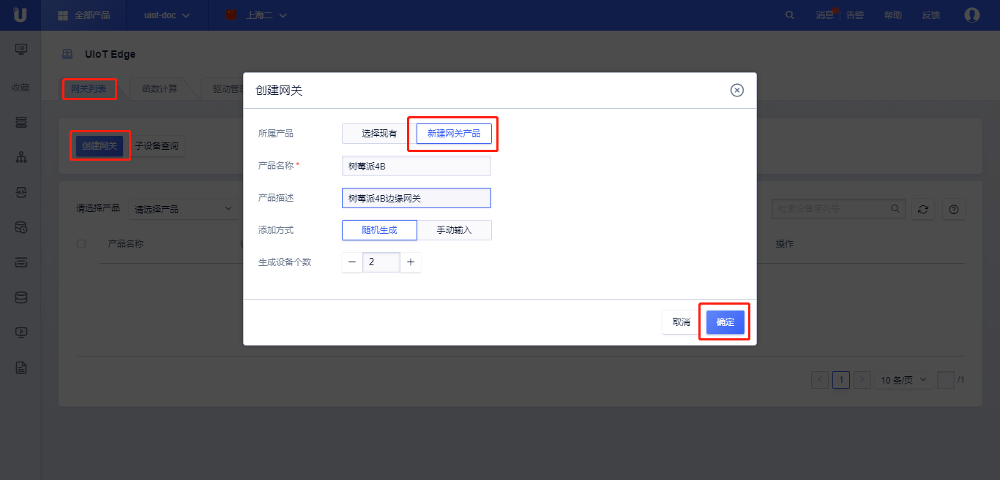
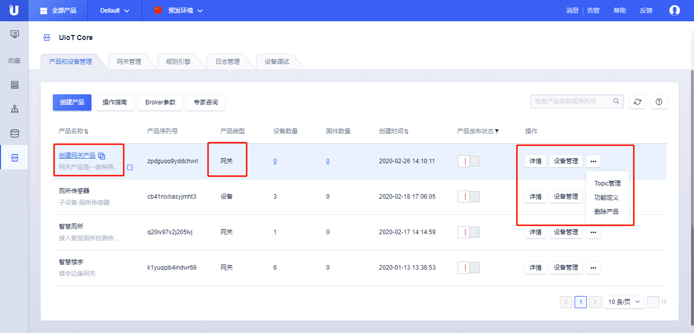

# 创建网关

关于物联网平台产品和设备，可以参考UIoT Core物联网通信云平台的[创建产品]()、[创建设备]()，了解相关的概念。物联网产品分为3类，普通产品、网关产品、子设备产品。

使用UIoT Edge需要先创建**网关产品**，然后在该产品下创建**网关设备**。每个网关设备可以独立地管理自己的子设备、驱动、函数计算、消息路由等功能。

**网关产品**是一类特殊产品，除了普通产品的功能外，还有网关特有的功能，本节介绍了网关产品和普通产品相对应的功能，而网关的一些特殊功能在后续章节介绍。

## 创建网关产品

### 操作步骤 

1. 登录进入UCloud[物联网平台](https://console.ucloud.cn/uiot)
2. 选择<产品和设备管理>标签，点击<创建产品>
3. 在弹出的对话框中输入<产品名称>和产品<描述>，选择产品类型为网关
   - 产品名称：名称长度为4-32个字符，可包含中文、字母、数字、`_`、`-`、`@`、`:`的组合；
   - 产品类型：网关；
   - 描述：支持任意字符，长度限制0-100个字符；

4. 点击<确定>，创建**网关产品**成功；
5. 创建**网关产品**成功后，可以在产品列表页查看该产品，类型为**网关**
   - 点击<产品名称>或<详情>，进入**网关产品**详情页；
   - 产品类型，该产品的类型为网关；
   - 点击<设备数量>，进入[设备管理](https://docs.ucloud.cn/iot/uiot-core/console_guide/product_device/create_devcies?id=管理设备)页；
   - 创建时间：产品创建的时间，可以进行排序显示；
   - 点击<产品发布状态>，发布产品或取消发布产品，产品一旦发布将不能修改物模型、Topic等，可以进行筛选；
   - 点击<设备管理>，进入[设备管理](https://docs.ucloud.cn/iot/uiot-core/console_guide/product_device/create_devcies?id=管理设备)页；
   - 点击<...>，进行[Topic管理](https://docs.ucloud.cn/iot/uiot-core/console_guide/product_device/topic)，[功能定义](https://docs.ucloud.cn/iot/uiot-core/console_guide/thingmode/thingmode_guide)，[删除产品](https://docs.ucloud.cn/iot/uiot-core/console_guide/product_device/create_products?id=删除产品)操作；

### 网关产品详情

创建完**网关产品**后，点击<详情>或点击<产品名称>，可以查看该网关的相关信息，网关的产品与普通产品详情信息一致，具体使用可以参考UIoT Core产品的相关介绍：**[产品概览]()**、**[设备管理](https://docs.ucloud.cn/iot/uiot-core/console_guide/product_device/create_devcies?id=管理设备)**、**[Topic管理](https://docs.ucloud.cn/iot/uiot-core/console_guide/product_device/topic)**、**[功能定义（物模型）](https://docs.ucloud.cn/iot/uiot-core/console_guide/thingmode/thingmode_guide)**。

### 删除网关产品

创建完**网关产品**后，点击<...>，选择<删除产品>，可以根据提示删除该产品。

删除**网关产品**注意事项：

- 删除**网关产品**不可恢复，需要谨慎操作；
- 删除**网关产品**需要先删除**网关产品**下的设备，否则不能删除；

## 创建网关设备

创建完**网关产品**后，我们可以创建属于该**网关产品**的单个设备，也可以批量创建多个设备，本节先介绍如何创建单个设备。

网关设备创建后，就可以在[网关管理]()页面配置其相关的功能。

### 操作步骤

1. 登录进入UCloud[物联网平台](https://console.ucloud.cn/uiot)；

2. 选择<产品和设备管理>标签；

3. 单击上述创建的**网关产品**，进入**网关产品**详情页；

4. 点击<设备管理>标签；

5. 点击<添加设备>，添加设备有两种方式，可以参考[随机生成]()、[手动输入]()；

6. 添加设备成功后，可以查看`设备序列号`和`设备密码`，网关在安装软件时会使用到该凭证；

7. 设备创建成功后，可以在设备列表页查看该设备的相关信息，也可以对设备进行<启用>、<禁止>、<删除>；

### 网关设备常规功能管理

网关设备添加之后可以对设备进行查看、管理、禁用。

#### 网关设备详情

依次点击<设备管理>标签，找到需要查看的设备，点击该设备<设备序列号>或<详情>，则进入了设备详情页。

设备详情页的基本功能可以参考[基本信息]()、[物模型属性、命令、事件]()、[设备影子]()、[文件管理]()。

- 子设备管理
  - 绑定子设备：在该网关设备下绑定子设备。绑定子设备需要参考[创建子设备]()小节，先创建类型为**子设备**的产品然后创建该**产品**的实例设备；子设备绑定之后，边缘网关则有权限代理该子设备进行消息的上下行；
  - 启用：启用表示当前网关拥有操作该子设备的权限；
  - 禁用：禁用表示取消当前网关操作该子设备的权限；
  - 解绑：解除子设备与网关的绑定关系；
  - 详情：查看该子设备的相关内容，参考[子设备详情]()；

#### 网关设备禁用和删除

网关设备的禁用和删除和普通设备的禁用和删除功能一样，可以参考[设备禁用]()和[设备删除]()。

删除后的设备将不再出现在设备列表中，可以通过添加设备重新添加该序列号设备，重新配置相关信息。

