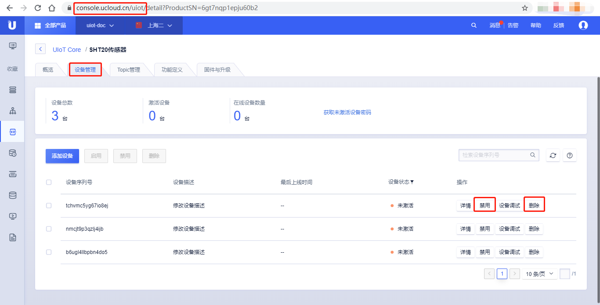

# 创建子设备

子设备是指通过网关代理才能接入云平台的一类设备，子设备的特点：

- 子设备必须绑定到某个网关下面才能使用；
- 子设备本身不能通过MQTT直接接入物联网平台，否则会提示子设备无权限登录；

## 创建子设备

本节介绍了如何在UIoT Edge控制台快速创建子设备，并绑定到某个网关设备下。用户也可以通过UIoT Core控制台的[创建产品]()、[创建设备]()创建类型为【子设备】的产品及设备。

### 操作步骤 

1. 登录进入UCloud[物联网边缘网关](https://console.ucloud.cn/uiot_edge)
2. 选择创建的网关产品，点击<详情>，进入网关管理页面
3. 选择<子设备列表>
4. 选择<添加设备>
5. 在弹出的对话框中可以通过<选择现有>或<新建子设备产品>快速创建子设备产品和设备
   - 选择现有：选择已经创建的子设备产品和子设备
   - 新建子设备：
     - 产品名称：名称长度为4-32个字符，可包含中文、字母、数字、`_`、`-`、`@`、`:`的组合
     - 产品描述：支持任意字符，长度限制0-100个字符
     - 子设备序列号：可以参考[随机生成]()、[手动输入]()
6. 点击<确定>，创建或选择**子设备**成功，并成功绑定到当前网关设备下；

### 其他操作

#### 删除子设备产品

目前UIoT Edge控制台不提供删除子设备产品的功能，删除产品需要进入UIoT Core，选择相应的子设备产品，点击<...>，选择<删除产品>，可以根据提示删除该产品。

#### 禁用和删除子设备

UIoT Edge控制台提供了启用/禁用快捷入口。用户也可以通过UIoT Core平台操作子设备的禁用、删除，操作步骤普通设备的禁用、删除一致，可以参考[设备禁用]()和[设备删除]()。

子设备删除注意事项：

- 删除网关子设备会自动删除该子设备和网关的绑定关系；

