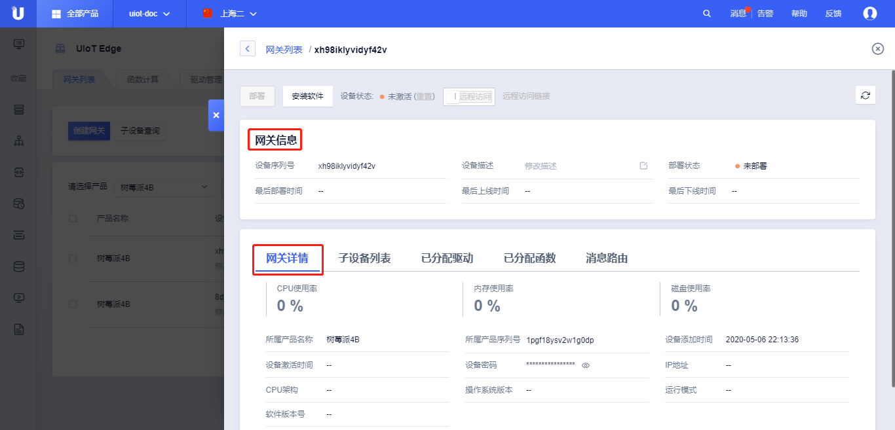

# 网关管理

网关管理页面，是网关核心功能的入口。

本节主要介绍网关管理页面的功能概览以及子设备绑定相关的功能，[子设备驱动与接入]()、[函数计算]()、[消息路由]()将在其它章节展开详细介绍。

## 操作步骤

1. 登录进入UCloud[物联网平台](https://console.ucloud.cn/uiot)
2. 选择<网关管理>标签
   - <网关列表>：所有网关产品及网关设备列表、网关可分配资源管理；
   - <函数计算>：新增、修改、删除、检索函数计算，网关设备可自由分配所需的函数计算；
   - <驱动管理>：新增、修改、删除、检索子设备驱动，网关设备可自由分配所需的驱动；
3. 点击<网关列表>
   - <请选择产品>：选择需要操作的网关产品；
   - 批量<启用>、<禁用>网关设备，与普通设备的[启用]()和[禁用]()一致；
   - 产品序列号：网关设备所属的产品序列号；
   - 设备序列号：网关设备的设备序列号；
   - 设备描述：网关设备创建时添加的描述；
   - 网关状态：网关设备当前的状态，包括未激活、离线、在线、已禁用等状态； 
   - 部署状态：网关设备的软件安装、服务部署等状态，包括；未部署、正在部署、部署失败、部署超时、部署成功等状态；
   - 最后部署时间：最后一次部署的时间；
   - <详情>：进入网关的可分配资源管理界面，包括[安装软件]()、[远程管理]()、网关信息、[子设备列表]()、[已分配驱动]()、[已分配函数]()、[消息路由]()、[监控信息]()等；
   - <重装软件>：重新安装软件，[安装网关软件]()章节中详细介绍；
   - <启用/禁用>：启用或禁用该设备；
4. 选择需要操作的网关产品
5. 选择相应的网关设备，点击<详情>，进入该网关的可分配资源管理界面

## 网关功能操作

网关详情页面可以对网关使用的驱动、函数计算、消息路由、子设备等资源进行管理。

#### 网关详情

- <部署>：当发生**已分配驱动**、**已分配函数**、**消息路由**发生变化时，可点击部署，下发到网关；

- <安装软件>：网关初次使用，需要安装UIoT Edge运行时，参考[安装网关软件]()；

- <远程服务ON/OFF>：是否开启或关闭远程运维服务；

  - <远程访问>：点击可以远程访问边缘网关；

  - <分享远程访问>：分享远程访问给第三方，用户需要谨慎使用该功能；TODO：安全问题？分享时限；

- 设备信息：TODO：已经改版

  - 设备基本信息：设备序列号、设备描述、所属产品序列号、设备密码；
  - 状态：网关设备的当前的状态，包括未激活、离线、在线、已禁用等状态；
  - 添加时间：网关设备创建的时间；
  - 激活时间：网关设备首次激活的时间；
  - 最后上线时间：网关设备最后上线时间；
  - 最后下线时间：网关设备字后下线时间；
  - IP地址：网关设备使用的IP地址；
  - 固件版本号：网关设备当前安装的版本号；
  - 部署状态：网关设备的软件安装、服务部署等状态，包括；未部署、正在部署、部署失败、部署超时、部署成功等状态；
  - 最后部署时间：最后一次部署的时间；

- 子设备列表：

  - <绑定子设备/解绑>：绑定或解除绑定子设备；
  - <启用/禁用>：批量启用或禁用所绑定的子设备；
  - 产品名称：子设备产品名称；
  - 设备序列号：子设备的设备序列号；
  - 设备描述：子设备的设备描述；
  - 最后上线时间：子设备的最后上线时间；
  - 设备状态：子设备的状态，包括未激活、离线、在线、已禁用等状态；
  - 操作：<启用/禁用>----启用或禁用子设备；<解绑>----解绑子设备；

- 已分配驱动：

    分配驱动需要在[驱动管理]()中先添加驱动；

  - <分配驱动/移除>：分配驱动给当前网关或从当前网关移除驱动；
  - 驱动列表：参考[分配驱动到边缘网关]()；TODO：应该是操作

- 已分配函数：

  分配函数需要在[函数计算]()中先添加函数计算；

  - <分配函数/移除>：分配函数计算给当前网关或从当前网关移除驱动；
  - 函数计算列表：参考[分配驱动到边缘网关]()；TODO：应该是操作

- 消息路由：

  - <新增消息路由/删除>：新增或者删除消息路由；
  - 消息路由列表：参考[消息路由概览]()；

- 监控信息：

  - TODO：

