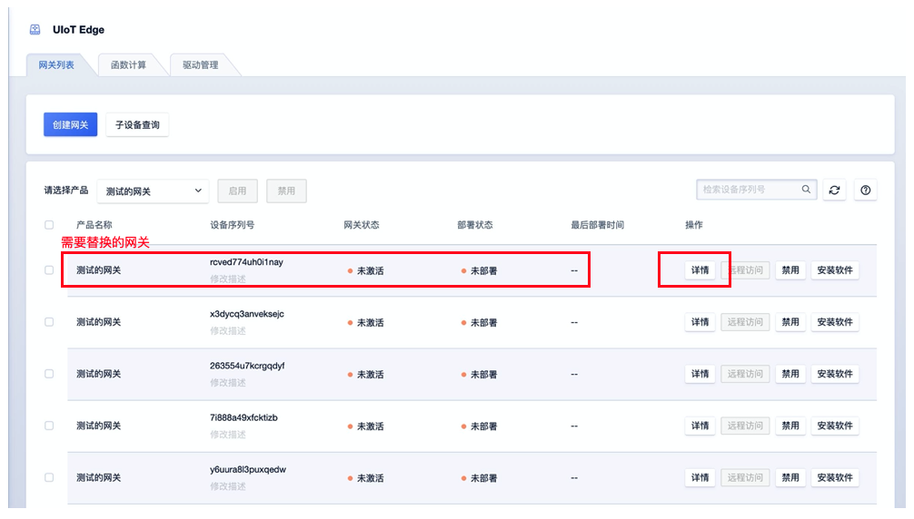
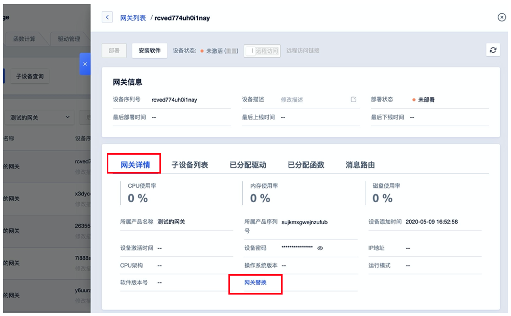
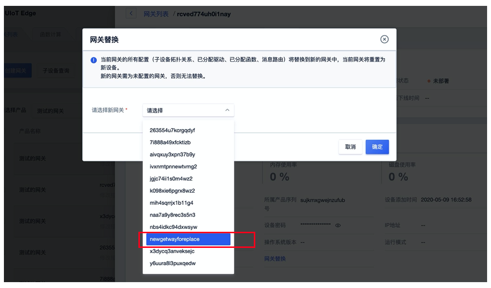

# 网关替换

在实际应用场中，可能因为网关硬件损坏需更新新的硬件设备。更新换的硬件同时需保留原有网关的配置（子设备拓扑关系、驱动配置、函数计算、消息路由等），UIoT Edge在控制台提供替换网关功能。

## 替换限制

1、替换的新网关设备额需于原网关设备为相同产品。

2、新网关设备需未进行任何配置。

3、替换后，新网关需再次部署才能将配置下发到网关硬件设备中。

4、替换后的原网关设备配置信息将被清空。

## 使用流程

1. 在控制台网关列表中找到需要替换的网关设备进入网关详情页面。
2. 进入网关详情页面找到网关替换功能。
3. 选择替换的新网关设备（系统会自动过滤掉不可替换的网关设备），点击【确定】进行替换。

### 流程示例如下 

**找到需要替换的网关替换设备（原网关）** 

**进入网关详情页面找到【网关替换】功能** 

**选择替换的新网关设备** 

