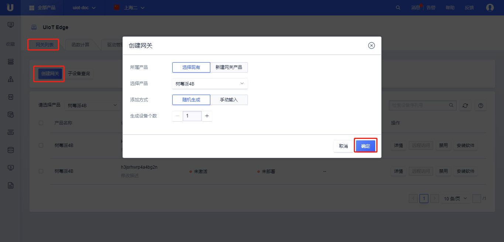
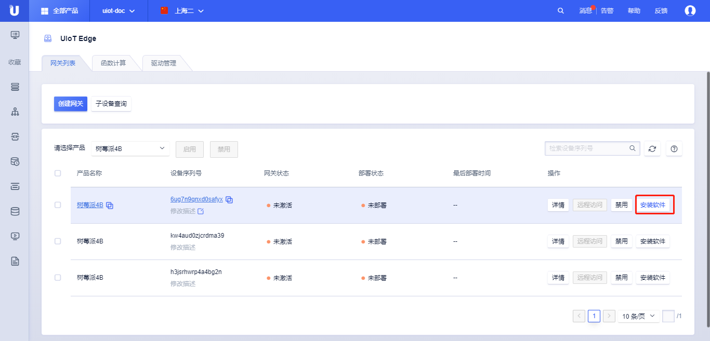
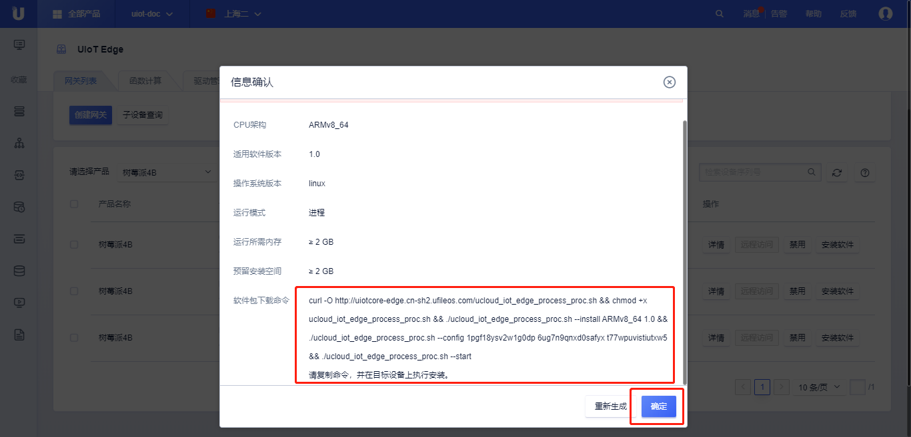
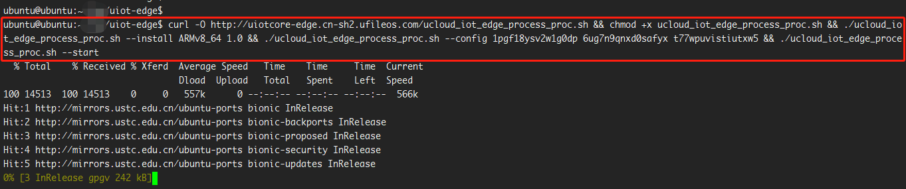
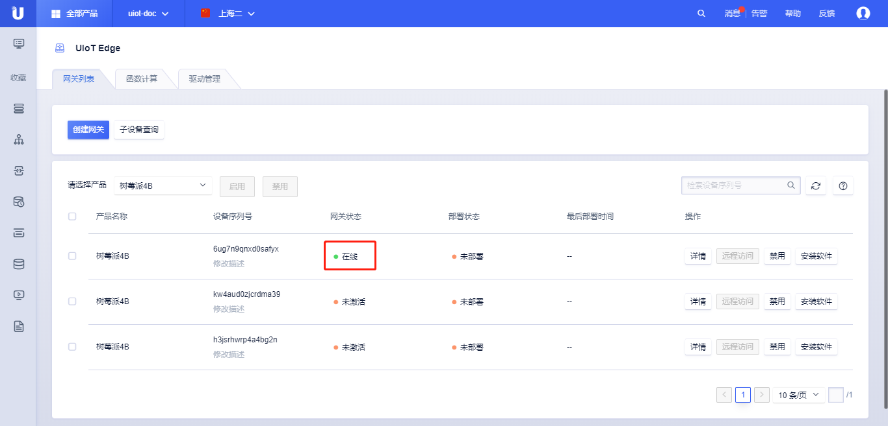

# 安装软件

安装软件是指将UCloud物联网边缘网关运行时软件包安装到边缘硬件中，本文将详细介绍如何安装UIoT Edge运行时。

## 准备工作

#### 网络

具有外网接入能力，能够接入公有云并连接到[UIoT Core物联网通信云平台](https://console.ucloud.cn/uiot)。

#### 硬件

可以运行linux系统的硬件设备，架构包括：x86、armv7、armv8。

#### 操作系统

UIoT Edge仅支持运行在linux下，暂不支持其他内核版本及windows系统。

linux推荐使用以下发行版本，自裁剪系统或其他发行版本将在后续版本中陆续支持，敬请期待：

- x86_64：ubuntu18.04、centos7.0
- armv7：raspbian GNU、ubuntu18.04
- armv8：ubuntu18.04

#### 安装依赖

UIoT Edge软件包的安装仅依赖curl工具，其他的依赖会自动安装，安装要求具备联网能力。

## 操作步骤

本文档以安装网关到x86_64下ubuntu 18.04为例，讲解安装软件全过程。

### 创建网关产品及网关设备

安装软件需要先[创建网关](/uiot-edge/user_guide/edge_subdevice/create_edge)。创建成功后，该网关具有唯一的产品序列号ProductSN、设备序列号DeviceSN、设备密码DeviceSecret，可以获取一键安装脚本进行软件的安装。

1. 登录进入UCloud[物联网边缘网关](https://console.ucloud.cn/uiot_edge)
2. 根据[创建网关](/uiot-edge/user_guide/edge_subdevice/create_edge)文档说明及页面提示，点击<创建网关>，选择<新建网关产品>，创建一个网关产品，命名为**智能边缘网关**，并<随机生成>1个设备，点击<确定>；



### 安装软件

1. 获取安装脚本
   - 通过<请选择产品>选择相应的边缘网关产品及边缘网关设备、点击<详情>，进入该边缘网关的管理界面；
   - 进入详情页后，选择<安装软件>；
   - 选择<CPU架构> ---- ARMv8_64、<适用软件版本> ---- 1.0、<操作系统版本> ---- linux，<运行模式> ---- 进程或容器，点击<确定>；
   - 在弹出的**信息确认**框内，检查相关配置，获取软件包下载命令。





2. 安装软件包

   - 登录网关设备，进入安装UIoT Edge的目录，粘贴并运行上述安装命令；

     ```bash
     # 脚本安装依赖`curl`工具，需要提前安装。
     curl -O http://uiotcore-edge.cn-sh2.ufileos.com/ucloud_iot_edge_process_proc.sh && chmod +x ucloud_iot_edge_process_proc.sh && ./ucloud_iot_edge_process_proc.sh --install ARMv8_64 1.0 && ./ucloud_iot_edge_process_proc.sh --config 1pgf18ysv2w1g0dp 6ug7n9qnxd0safyx t77wpuvistiutxw5 && ./ucloud_iot_edge_process_proc.sh --start
     ```

     

   - 系统会自动下载安装软件包，并启动UIoT Edge运行时；
   - 进入物联网边缘网关控制台，通过<请选择产品>，找到该网关设备，可以查看网关目前的状态为**在线**；
   - 安装成功，边缘网关成功与物联网云平台建立连接。

     

## 其他操作

### 停用UIoT Edge

1. 登录目标边缘网关，在安装目录下，找到脚本`ucloud_iot_edge_process.sh`，执行以下命令：

   ```bash
   ucloud_iot_edge_process.sh --stop
   ```

2. 看到以下打印，则停用成功。

   ```bash
   stop all servers completed
   ```

3. 进入物联网平台控制台，依次点击<网关管理>、<网关列表>、<选择产品>，可以查看网关目前的状态为**离线**；

     

### 重装UIoT Edge

重新安装，会覆盖edge端的所有程序及配置，重新部署后会重新部署当前子设备驱动、函数计算、消息路由等配置。

1. 进入物联网平台控制台，依次点击<网关管理>、<网关列表>、<选择产品>；
2. 点击<安装软件>，详情请参考[安装软件](/uiot-edge/user_guide/install/runtime_install)；
3. 选择<CPU架构> ---- ARMv8_64、<适用软件版本> ---- 1.0、<操作系统版本> ---- linux，<运行模式> ---- 进程或容器，点击<确定>；
4. 在弹出的**信息确认**框内，可以查看相关配置，获取软件包下载命令；
5. 登录网关设备，粘贴并运行上述安装命令；
6. 安装成功后，登录控制台确认边缘网关状态为**在线**。

### 接入子设备

网关软件安装成功后，可以接入子设备，添加子设备驱动、配置消息路由、函数计算、远程运维，具体参考[子设备驱动与接入](/uiot-edge/user_guide/subdevice_driver_access/overview)、[设置消息路由](/uiot-edge/user_guide/message_route/overview)、[添加边缘计算](/uiot-edge/user_guide/edge_computing/overview)、[远程运维管理](/uiot-edge/user_guide/remote_maintaince/remote_access)。

