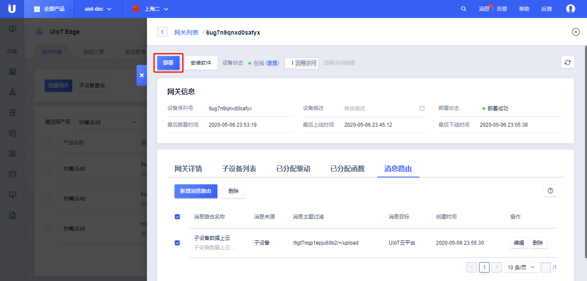

# 添加消息路由

本节介绍添加和部署消息路由。

## 添加消息路由

消息路由的核心是添加消息来源、主题过滤、消息目标。不同源之间的流转请参考[消息路由配置详解](/uiot-edge/user_guide/message_route/route_config_detail)。

### 操作步骤

1. 登录进入UCloud[物联网边缘网关](https://console.ucloud.cn/uiot_edge)
3. 通过<请选择产品>，选择需要添加消息路由的网关设备
4. 选择相应的设备，点击<详情>，进入该边缘网关的管理界面
5. 选择<消息路由>标签，点击<新增消息路由>，弹出的新增消息路由列表中
   - 消息路由名称：配置的该条消息路由名称；
   - 消息来源：该条消息路由规则的消息源，可以有3中选择：设备、IoT Core云平台、函数计算；
   - 主题过滤：指定转发来自消息来源的哪个Topic的消息：
     - 系统：系统提供的Topic，仅支持物模型；
     - 自定义：用户自定义的Topic；
     - 本地：指仅在网关本地（函数计算、非云端感知的子设备）流转的Topic，本地Topic的定义参考[关于本地Topic的一些限制](/uiot-edge/user_guide/message_route/add_msg_route#关于本地Topic的一些限制);
   - 消息目标：可以有3中选择：设备、UIoT Core（云平台）、函数计算；
   - 缓存：开启/关闭。开启离线缓存，若网关离线，消息将被缓存，待网关上线后发送消息到IoT Core（QoS质量为1）。只有消息目标是UIoT Core时才有。
6. 点击<确定>，新增消息路由成功；
7. 查看已经创建的消息路由列表
   - 消息路由基本信息：消息路由名称、消息路由描述、消息来源、消息主题过滤、消息目标、创建时间；
   - 操作：
     - <编辑>：编辑该条消息路由；
     - <删除>:  删除该消息路由；

#### 关于本地Topic的一些限制

本地Topic是指只能在网关本地进行消息流转的Topic，可给部分场景提供灵活性，本地Topic的定义需要遵循以下规范：

- 本地Toic不需要单独添加，在添加消息路在主题过滤时，选中<本地>，填入Topic即可；
- 本地Topic的使用需要用户自行维护，边缘网关不校验Topic的有效性，当来源消息与该条消息路由匹配时，立即会转发到目的地；
- 本地Topic和云端Topic的定义规范类似，以正斜线`/`做层级处理，`${ProductSN}`为抽象层级，表示`产品序列号`；`${DeviceSN}`为抽象层级，表示`设备序列号`；Topic的命名以`/`分割，每层可包含字母、数字、`-`、`_`、`@`、`:`、`+`、`#`，长度限制64，编辑部分最多支持5层；支持`+`和`#`，`#`只能放在结尾；
- 本地Topic路径的第一层不应当使用系统Topic的关键字，包括`/$system`，`/$broadcast`；
- 本地Topic禁止使用和云端自定义Topic相同的Topic；

### 消息路由删除

消息路由支持单个或批量删除消息路由规则。

1. 单个删除：点击某条操作列的<删除>，可以删除单条规则；
2. 批量删除：同时选中多条，点击左上角<删除>，可以批量删除多条规则；

**消息路由删除注意事项：**

1. 消息路由删除后，可以重新添加；
2. 删除消息路由后需要重新部署才能生效；

## 部署消息路由

消息路由增删/修改成功后，可以部署到网关上进行测试。部署消息路由需要网关为**在线状态**。

### 部署步骤

1. 登录进入UCloud[物联网边缘网关](https://console.ucloud.cn/uiot_edge)
2. 通过<请选择产品>选择相应的边缘网关产品及边缘网关设备、点击<详情>，进入该边缘网关的管理界面；
3. 进入详情页后，点击<部署>，则会将更新部署到网关设备上
4. 查看**部署状态**为部署成功
5. 根据消息的上报情况，可以查看消息路由是否配置成功

