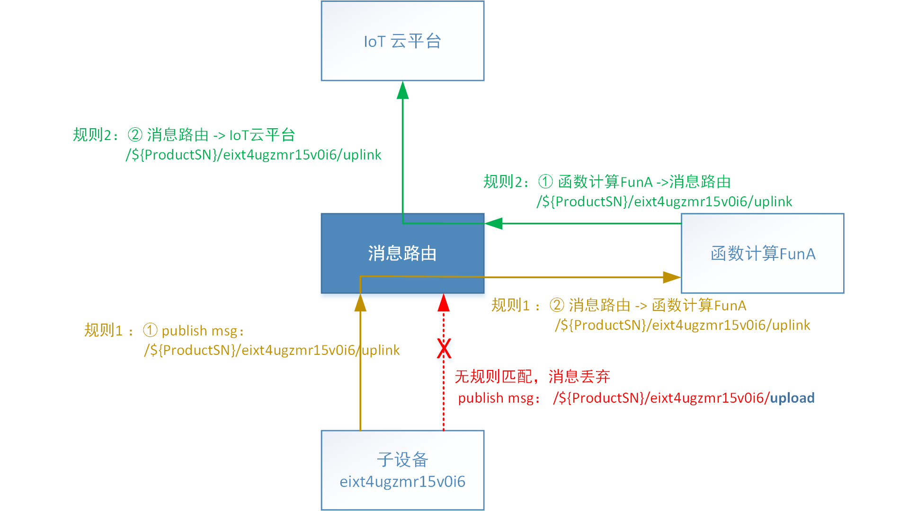

# 概览

消息路由使得通过Topic承载的消息可以在子设备、函数计算、UIoT Core云平台之间自由流转。消息路由是边缘网关的核心功能之一。

消息路由的工作原理基于三要素：**消息源**， **过滤Topic**，**目的地**。

消息源：函数计算、子设备、UIoT云平台；

目的地：函数计算、子设备、UIoT云平台；

过滤Topic：只有匹配的Topic（来自源消息），才会转发到目的地；

#### 举例

假设配置下面两条消息路由，规则分别为：

| 编号  | 消息源                   | 过滤Topic                             | 目的地             |
| ----- | ------------------------ | ------------------------------------- | ------------------ |
| 规则1 | 子设备：eixt4ugzmr15v0i6 | /${ProductSN}/eixt4ugzmr15v0i6/uplink | 函数计算名称：FunA |
| 规则2 | 函数计算名称：FunA       | /${ProductSN}/eixt4ugzmr15v0i6/uplink | UIoT云平台         |

则可以通过下图查看消息的流转过程，所有消息都是通过消息路由流转：

## 消息路由使用流程

1. 规划边缘网关子设备、函数计算、云平台之间的消息流转路径；
2. 参考[添加消息路由](/uiot-edge/user_guide/message_route/add_msg_route)依次添加消息路由（配置消息来源、主题过滤、消息目标）；
4. 重新部署，下发消息路由更新到边缘网关，测试运行。

