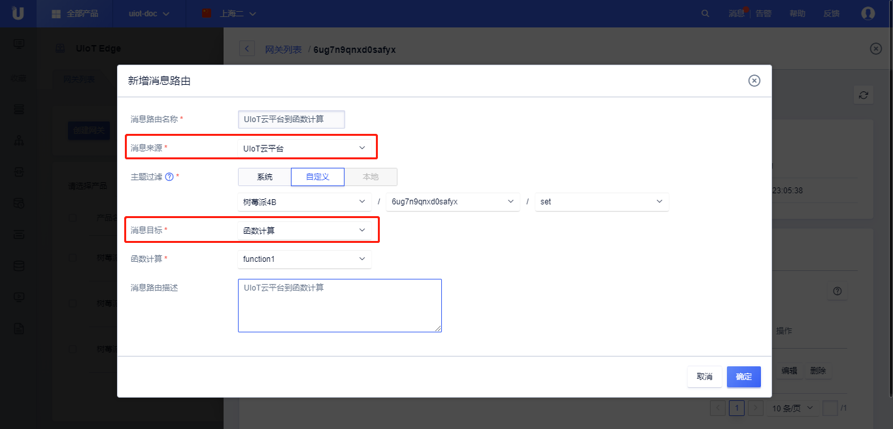

# 消息路由配置详解

本文介绍不同消息源与目的地（函数计算、子设备、UIoT Core云平台）之间流转的典型示例。

可以通过配置多条消息路由首尾相接实现级联。级联往往以**子设备、UIoT云平台**为起点或终点，中间经过一次或多次**函数计算**。

## 消息路由支持的流转类型

消息路由流转可以使用以下两类Topic，Topic支持 `+`、`#` 通配符，通配符的使用方法可以参考[Topic通配符](https://docs.ucloud.cn/iot/uiot-core/console_guide/product_device/topic?id=topic通配符)：

1. 针对在UIoT Core物联网平台定义的[系统Topic](https://docs.ucloud.cn/uiot-core/console_guide/product_device/topic#系统Topic)、[自定义Topic](https://docs.ucloud.cn/uiot-core/console_guide/product_device/topic#用户自定义Topic)：

| 消息源          | 可过滤Topic                                   | 目的地          |
| --------------- | --------------------------------------------- | --------------- |
| UIoT Core云平台 | 网关本身：下行Topic     子设备：下行Topic  | 函数计算        |
| UIoT Core云平台 | 子设备：下行Topic                             | 子设备          |
| 函数计算        | 网关或子设备：上下行Topic均可                 | 函数计算        |
| 函数计算        | 子设备：下行Topic                             | 子设备          |
| 函数计算        | 网关本身：上行Topic     子设备：上行Topic | UIoT Core云平台 |
| 子设备          | 子设备：上行Topic                             | 函数计算        |
| 子设备          | 子设备：上行Topic                             | UIoT Core云平台 |

2. 针对边缘网关[本地Topic](/uiot-edge/user_guide/message_route/add_msg_route#关于本地Topic的一些限制)，本地Topic不能流转到云平台，所以消息源或目的地为**UIoT Core云平台**的不能参与流转：

| 消息源   | 可过滤Topic | 目的地   |
| -------- | ----------- | -------- |
| 子设备   | 本地Topic   | 函数计算 |
| 函数计算 | 本地Topic   | 函数计算 |
| 函数计算 | 本地Topic   | 子设备   |

## 流转示例

#### UIoT云平台 ——> 函数计算

1. 根据[添加消息路由](/uiot-edge/user_guide/message_route/add_msg_route)，新增消息路由；

2. 消息来源：选择 <IoT Core> ；

3. 主题过滤：可以是网关本身的下行Topic，或者为子设备的下行Topic，**本例以子设备的下行Topic为例**；

4. 消息目标：选择<函数计算>；

5. 添加成功后，点击<确定>；

#### UIoT云平台 ——> 子设备

1. 根据[添加消息路由](/uiot-edge/user_guide/message_route/add_msg_route)，新增消息路由；

2. 消息来源：选择 <IoT Core> ；

3. 主题过滤：只能为子设备的下行Topic；

4. 消息目标：选择<子设备>；

5. 添加成功后，点击<确定>；

#### 函数计算 ——> 函数计算

1. 根据[添加消息路由](/uiot-edge/user_guide/message_route/add_msg_route)，新增消息路由；
2. 消息来源：选择 <函数计算> ；
3. 函数名称：选择需要流转的源函数名；
4. 主题过滤：网关或子设备的任意Topic均可，同时支持本地Topic，**本例以本地Topic为例**；
5. 消息目标：选择<函数计算>；
6. 函数名称：选择需要流转的目的地函数名；
7. 添加成功后，点击<确定>；

#### 函数计算 ——> 子设备

1. 根据[添加消息路由](/uiot-edge/user_guide/message_route/add_msg_route)，新增消息路由；
2. 消息来源：选择 <函数计算> ；
3. 函数名称：选择需要流转的源函数名；
4. 主题过滤：支持子设备的下行Topic，同时支持本地Topic，**本例以子设备下行Topic为例**；
5. 消息目标：选择<子设备>；
6. 添加成功后，点击<确定>；

#### 函数计算 ——>UIoT云平台

1. 根据[添加消息路由](/uiot-edge/user_guide/message_route/add_msg_route)，新增消息路由；
2. 消息来源：选择 <函数计算> ；
3. 函数名称：选择需要流转的源函数名；
4. 主题过滤：支持网关本身子设备的上行Topic，**本例以子设备上行Topic为例**；
5. 消息目标：选择<IoT Core>；
6. 添加成功后，点击<确定>；

#### 子设备 ——> 函数计算

1. 根据[添加消息路由](/uiot-edge/user_guide/message_route/add_msg_route)，新增消息路由；
2. 消息来源：选择<子设备> ；
3. 主题过滤：支持子设备的上行Topic，同时支持本地Topic，**本例以子设备上行Topic为例**；
4. 消息目标：选择 <函数计算>；
5. 函数名称：选择需要流转的源函数名；
6. 添加成功后，点击<确定>；

#### 子设备——>UIoT云平台

1. 根据[添加消息路由](/uiot-edge/user_guide/message_route/add_msg_route)，新增消息路由；
2. 消息来源：选择<子设备> ；
3. 主题过滤：仅支持子设备的上行Topic；
4. 消息目标：选择 <IoT Core>；
5. 添加成功后，点击<确定>；

