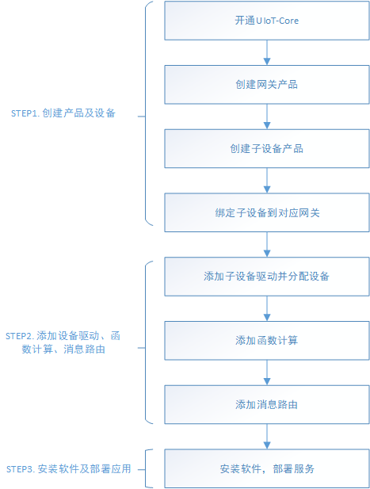

# 使用流程概述

UIoT Edge结合UCloud物联网通信云平台可以实现云边协同，高效管理网关设备、子设备、网关与子设备的拓扑关系，以及在网关设备上部署设备驱动、函数计算、消息路由等资源。

本文介绍了UIoT Edge的使用流程。

### 使用流程

用户使用UIoT Edge可以分为3大步：
1. 分别创建网关类型和子设备类型的产品及设备；
2. 分配子设备驱动、函数计算，添加消息路由；
3. 安装软件及部署应用；

