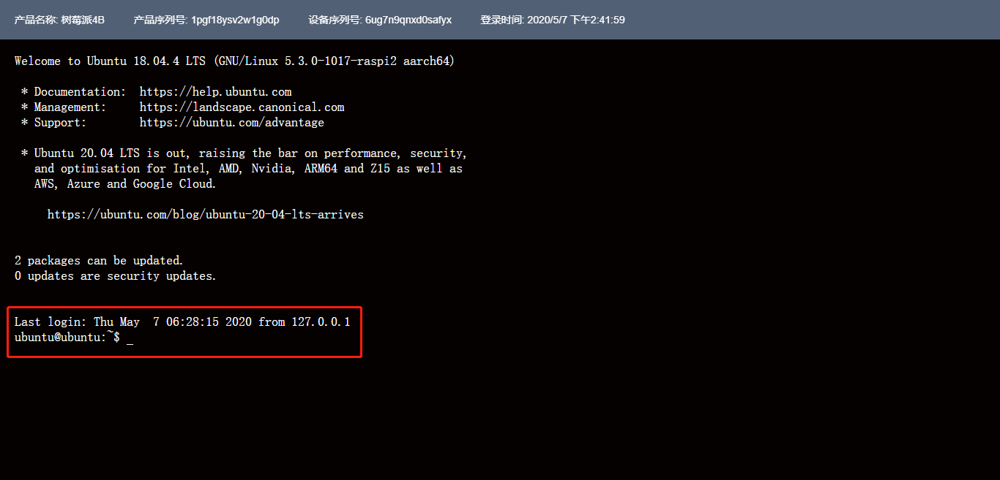

# 远程访问

远程访问给用户提供了可以通过远程SSH访问边缘网关的能力。

## 操作步骤

1. 登录进入UCloud[物联网边缘网关](https://console.ucloud.cn/uiot_edge)
2. 通过<请选择产品>选择相应的边缘网关产品及边缘网关设备、点击<远程访问>
3. 或者通过点击<详情>，进入该边缘网关的详情页，点击<远程访问>

3. 打开<远程访问>后，点击<远程访问链接>
4. 输入边缘网关linux系统的用户名和密码，即可完成远程登陆

