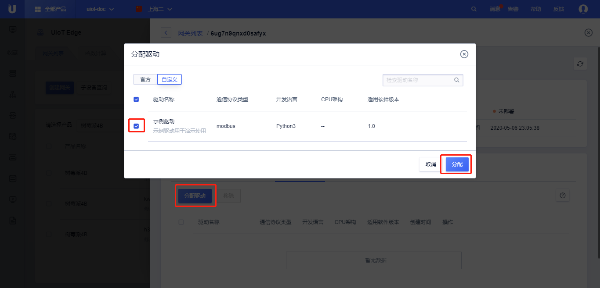
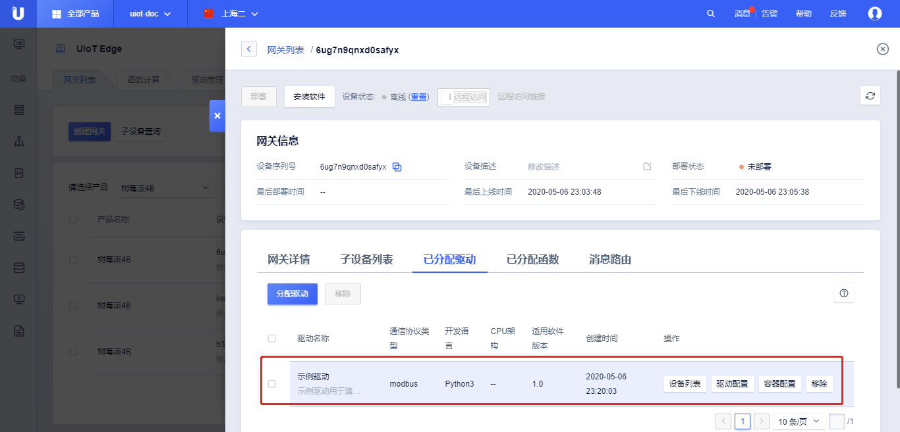
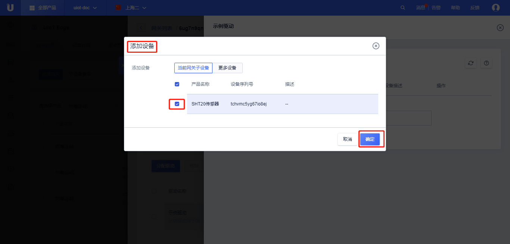
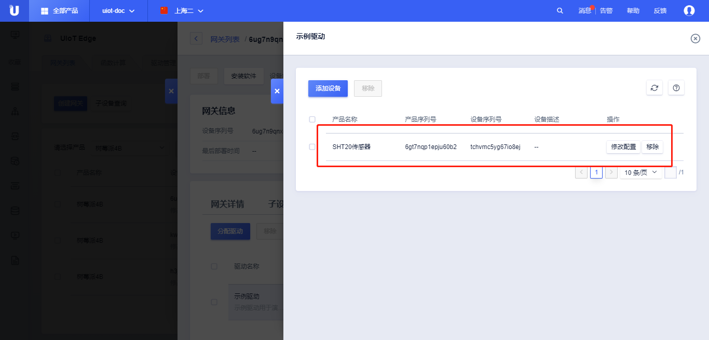
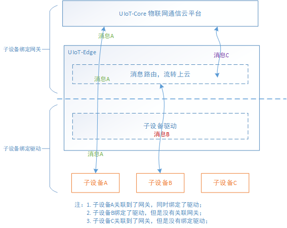
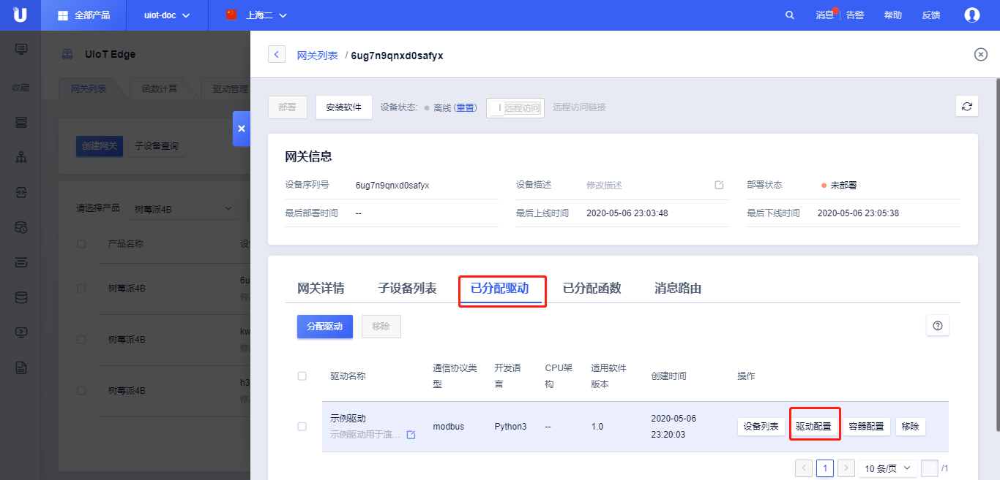
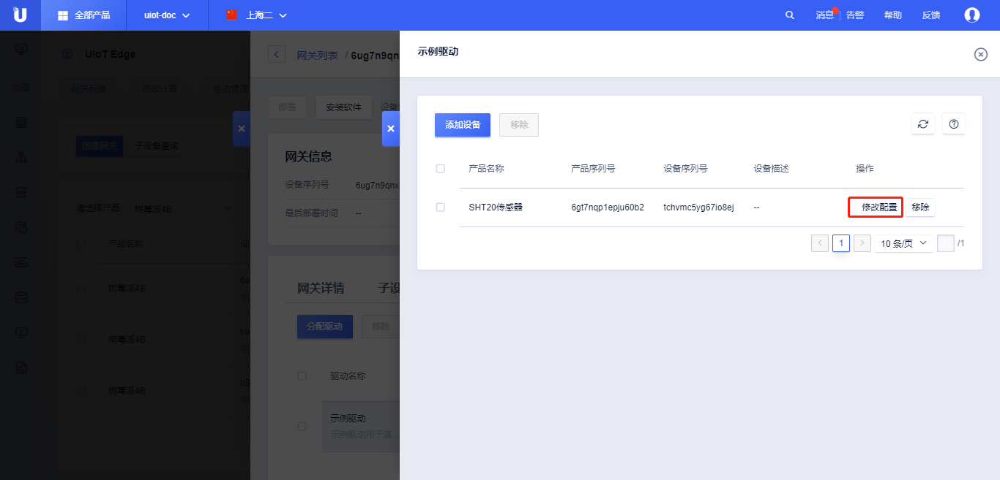
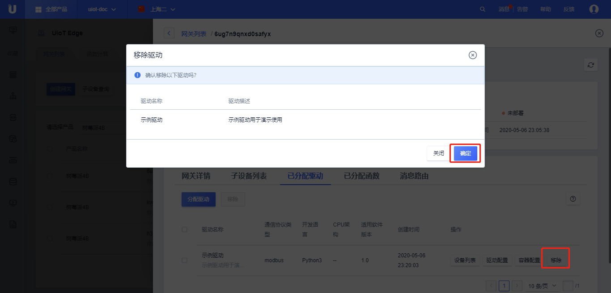
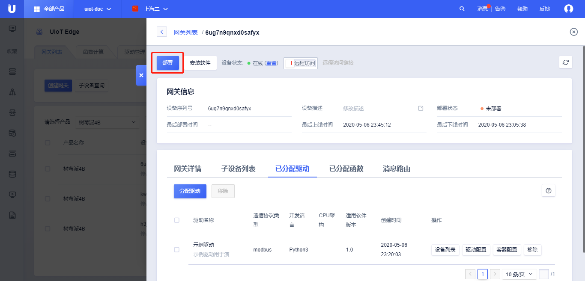
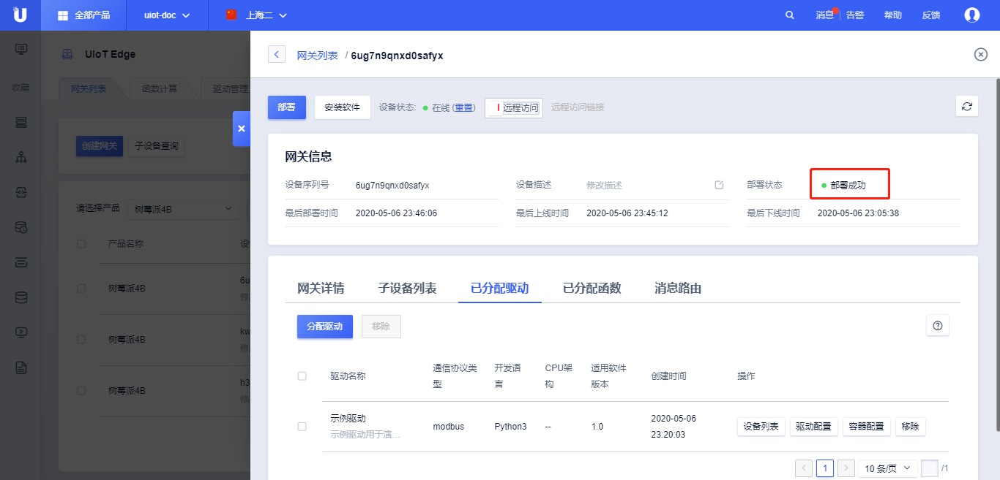

# 分配驱动

驱动成功添加到驱动管理后，就可以将驱动分配给网关使用，并绑定给相应的子设备。

## 分配驱动

在上一节[驱动开发及添加]()后，本节进行驱动的分配和部署调试。

### 分配步骤

1. 登录进入UCloud[物联网平台](https://console.ucloud.cn/uiot)
2. 选择<网关管理>标签，点击<网关列表>，进入网关列表管理
3. 点击<请选择产品>，选择需要分配的网关产品
4. 选择相应的设备，点击<详情>，进入该网关的可分配资源管理界面
5. 选中<已分配驱动>标签，点击<分配驱动>，弹出的分配驱动列表中
   - 驱动名称：可用驱动的名称；
   - 驱动描述：可用驱动的描述；
   - 通信协议：列出当前驱动的通信协议；
6. 选择需要分配给该网关的驱动，点击<分配>，可以同时选中多个进行分配，分配完成后关闭该弹窗；
7. 可以看到已分配的驱动列表
   - 驱动基本信息：驱动名称、驱动描述、通信协议类型、开发语言、CPU架构、适用软件版本、创建时间；
   - 操作：
     - <绑定设备列表>：绑定子设备到该驱动，子设备可以参考[创建子设备]()添加；
     - <驱动配置>：驱动的配置文件，用于配置驱动本身的属性。比如网关作为Modbus Master时使用的串口设备(/dev/ttyS0)、波特率(115200)等，详细可参考[驱动配置]()；

### 绑定设备列表

驱动绑定子设备，需要先[创建子设备产品]()，并[创建子设备产品设备]()。

1. 点击<绑定设备列表>，在右侧滑窗中点击<添加设备>
2. 在弹窗中可以查看可以绑定的设备，分为<当前网关绑定设备>和<更多设备>
   - 当前网关绑定设备，指[网关已经关联的子设备]()；
     - 设备列表：产品名称，设备序列号，描述；
   - 更多设备，指尚未关联到当前网关，但是需要绑定到当前驱动的子设备，这类设备可能在接入驱动后，[动态关联到到网关]()；
     - 选择<产品名称>，支持检索；
     - 设备列表：产品名称、设备序列号、描述；
3. 选择<当前绑定设备>，选中需要绑定的**子设备序列号**，点击<确定>，成功后显示**已添加**
4. 选择<更多设备>，选择产品，选中选中需要绑定的**子设备序列号**，点击<确定>，成功后显示**已添加**
5. 点击<关闭>，可以看到成功绑定子设备到驱动，查看已绑定设备列表：
   - <添加设备>：再次添加设备；
   - <移除>：选中多个设备，批量移除设备；
   - 设备列表：产品名称，设备序列号，设备描述，操作；
   - 操作：
     - <修改配置>：修改配置采用JSON格式，配置设备接入驱动是的参数，比如Modbus中，配置子设备的从地址（Slave Address），，详细可参考[设备配置]()；
     - <移除>：移除该子设备；
6. 点击侧滑窗的<关闭>，驱动绑定子设备成功

### 驱动绑定子设备概念理解

- 驱动绑定子设备和[网关关联子设备]()，是两个不同层面的概念，前者表示子设备与网关通信采用哪种驱动，后者表示子设备与云端通信通过哪个网关；
- 子设备假如仅配置了**驱动绑定子设备**，则子设备可以通过该驱动上报数据给网关，但是网关不能代理该设备上报数据到云端；仅配置了驱动绑定子设备通常用于[网关动态关联子设备]()。
- 子设备假如仅配置了**[网关关联子设备]()**，则网关有了代理子设备上报数据到云端的能力，但是子设备并不知道通过哪种驱动和网关通信；
- 所以子设备如果要通过网关上报数据到云，需要同时做上面两件事。

### 驱动配置

驱动配置和设备配置需要对其进行正确的配置，否则可能会导致设备不能正常工作。

驱动配置和设备配置的理解，参考[驱动开发及添加]()；

1. 驱动配置：点击驱动列表的<驱动配置>按钮；
2. 设备配置：依次点击<绑定设备列表>，在绑定设备列表页点击<修改配置>；

### 驱动移除

驱动移除支持移除单个驱动和批量移除驱动。

1. 单个移除：直接点击某个设备操作列的<移除>，可以移除单个分配驱动；
2. 批量移除：同时选中多个设备，点击左上角<移除>，可以批量删除多个分配驱动；
3. 移除驱动绑定的设备：依次点击<绑定设备列表>，在绑定设备列表页点击<移除>，可以移除驱动绑定的设备；

**驱动移除注意事项：**

1. 移除驱动后，可以重新分配；
2. 移除驱动同时移除绑定的子设备，重新分配后不可恢复，需要重新添加；
3. 移除驱动需要重新部署后才能生效；

## 部署驱动

驱动分配成功后，可以部署到网关侧进行测试或者使用。部署驱动需要网关为**在线状态**。

### 部署步骤

1. 登录进入UCloud[物联网平台](https://console.ucloud.cn/uiot)
2. 选择<网关管理>标签，点击<网关列表>，进入网关列表管理
3. 点击<请选择网关>，选择需要分配的网关产品
4. 选择相应的设备，点击<详情>，进入该网关的管理详情页
5. 点击<部署>，则会将所有分配资源发生的改动部署到网关设备上
6. 查看**部署状态**为部署成功

