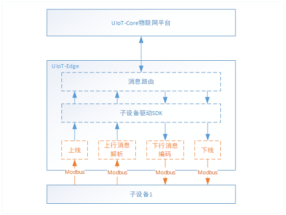
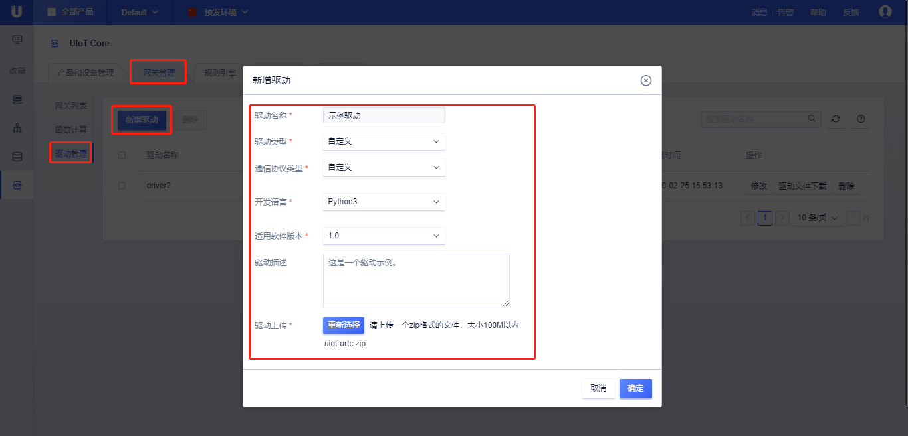

# 驱动开发及添加

## 驱动开发

驱动开发的主要任务是完成子设备的上线、下线以及数据的收发。

### 驱动示例

本例通过官方驱动示例【RelaySwitcher】讲解如何开发设备驱动。

子设备驱动主要工作是实现子设备与边缘网关之间的通信，具体功能包括解析并转发子设备上报的数据，监听云端下行的数据并转发给子设备，同时完成设备的上下线。




#### 一个简单的驱动实现（代码以示意为主）

全部代码可以参考：[Python3 SDK 使用流程]()

```c
config_info get_config()
{ 
    // 获取驱动配置信息
    Config.getDriverInfo();
    // 获取子设备配置
    Config.getDevicesInfos();
}

subdev_login(subdev)
{
    // 解析子设备协议上线消息
    if (get_subdev_login_msg() == true)
    {
        // 调用驱动SDK login接口
        subDevice.login();
    }
}

msg_callback()
{
    // 收到云端下行数据，驱动会调用该接口，并将云端数据解析为子设备协议数据下发给子设备
    send_downlink_msg_to_subdev();
}

subdev_uplink_msg(subDevice)
{
    payload = get_msg_from_subdev;
    // 发送数据到云端，调用驱动SDK 接口
    subDevice.publish(topic, payload);
}

main()
{ 
   // 1. 获取配置文件，包括驱动配置和子设备配置
   config_info = get_config();
   // 2. 初始化SubDevice对象，注册收到消息的回调函数
   subdev = SubDevice(productSN,deviceSN,callback);
   // 3. 子设备上线
   subdev_login(subdev);
    
   while(1)
   {
      // 4. 子设备上行数据
   	  subdev_uplink_msg(); 
      sleep(1);
   }
}
```

### 驱动相关配置

#### 驱动配置

驱动配置在[边缘网关详情]() -> [已分配驱动]()->[驱动配置]()修改，驱动配置一般包括两方面内容：

1）网关与子设备通信使用的通道等信息配置。以Modbus为例，比如channel1 = /dev/ttyS0, 9600, 8N1;

2）子设备属性集合表，即子设备协议指令获取的属性值如何转换成上云的协议字段。以Modbus为例，比如属性集为properties1，定义Modbus读取属性指令为`功能码0x04 寄存器地址0x01 读取数据长度0x01`，则对应上云的字段为`temperature`，则驱动会根据配置信息将上述指令读到的数据转为`{"temperature": 20}`上报到云端。

详细例子可以参考[官方Modbus驱动-驱动配置]()。

#### 子设备配置

子设备配置在[边缘网关详情]() -> [已分配驱动]()->[添加设备]()->[修改配置]()中修改，子设备配置主要包含以下几部分：

1）使用的通道。比如使用的上述驱动配置中的channel1；

2）使用的属性集。比如使用上述驱动配置中的properties1；

3）自身的信息。比如从地址 slaveId = 1；

4）轮询方式，轮询周期等。比如 period = 5；


**下一步**，添加驱动，并[分配给边缘网关]()，[部署测试]()。

## 添加驱动

驱动开发完成后，可以添加驱动并进行测试：

- 将驱动上传到驱动管理，见本节[操作步骤]()；
- 通过下一节的[分配驱动]()，将驱动分配给相应的边缘网关设备，并添加设备；
- 通过下一节的[部署驱动]()，进行测试、使用。

### 操作步骤

1. 登录进入UCloud[物联网边缘网关](https://console.ucloud.cn/uiot_edge)

2. 选择<驱动管理>标签

3. <官方/自定义>：选择官方驱动或自定义添加驱动，官方驱动包括RelaySwitcher示例和Modbus驱动

4. 点击<新增驱动>，在弹出的对话框中输入驱动相关信息
   - 驱动名称：驱动的名称，比如Modbus-RTU
   - 通信协议类型：驱动应用的子设备通信协议，比如Modbus、Bluetooth、自定义等；
   - 开发语言：驱动使用的开发语言，支持Python3和C两种；
   - CPU架构：当驱动开发语言为C语言是，需要选择CPU架构，分为x86_64、armv7、armv8；
   - 适用软件版本：可以在UIoT Edge哪个版本上使用；
   - 驱动描述：对驱动的描述；
   - 驱动上传：上传驱动，支持zip格式文件，大小<100M；

5. 点击<确定>，添加**驱动**成功；

6. 添加驱动成功后，可以在驱动列表中查看该驱动
   - 基本信息：驱动名称、驱动描述、通信协议类型、开发语言、CPU架构、适用软件版本、创建时间等；
   - 操作：
     - 修改：对驱动进行修改，仅支持驱动名称、适用软件版本、驱动描述、驱动文件的修改
     - 下载：下载该驱动文件
     - 删除：可以删除该驱动，删除驱动需要先移除该驱动与网关的分配关系，参考[分配驱动]()

7. <批量删除>：同时选择多个驱动，点击<删除>按钮，可以批量删除驱动；

   > **注：驱动删除需要先移除驱动与网关的分配关系，参考[分配驱动]()。**




