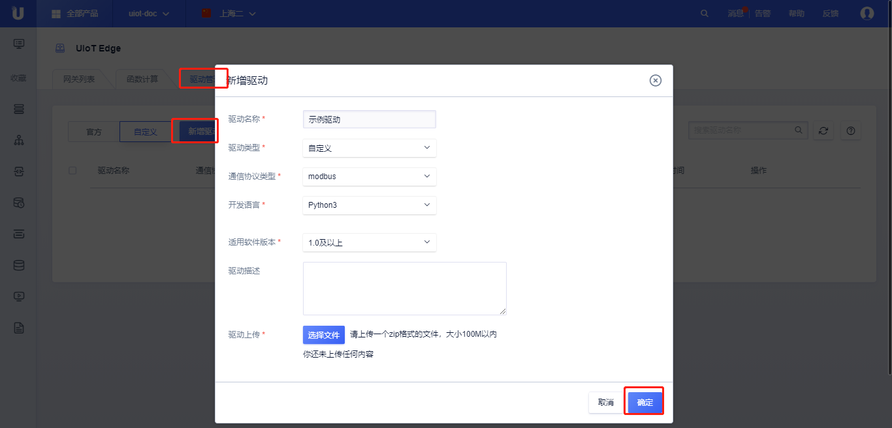
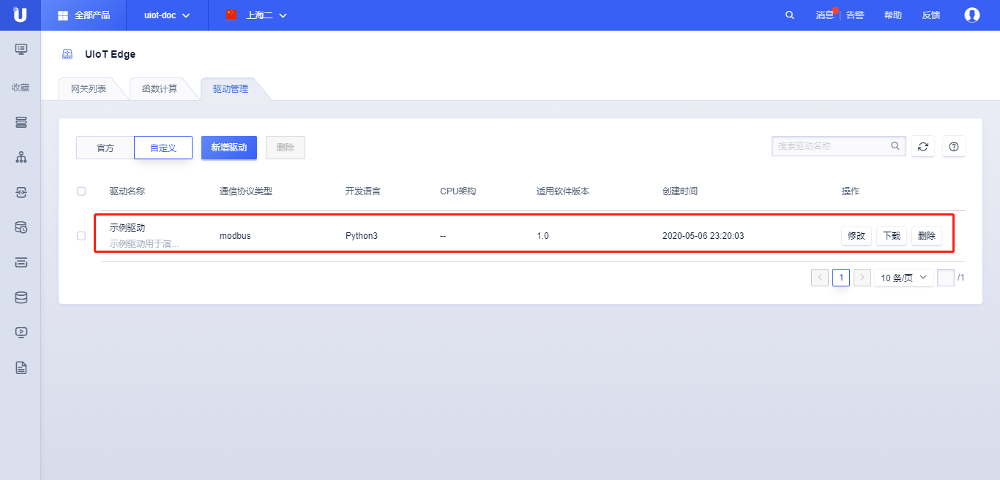

# 驱动开发及添加

UIoT Edge提供子设备接入的驱动框架，用户基于[驱动框架SDK]()编写各类协议的自定义驱动。子设备驱动完成子设备和UIoT Edge之间的数据通信交互。

自定义驱动SDK的接口参考边缘端开发-[子设备驱动SDK]()，子设备驱动SDK支持Python3和C语言；

## 驱动开发

驱动开发的主要任务是完成子设备的管理、子设备的上线、下线以及数据的转发。

### 驱动示例

本例通过通过Modbus RTU讲解开发一款驱动需要完成的事情，TODO

子设备驱动可以理解为子设备和网关之间的通信模块，主要工作是完成驱动的初始化、驱动下子设备的管理、上行数据的解析和下行数据的组包。


### 驱动配置概念理解TODO

在驱动开发中已经介绍驱动配置和设备配置，在分配驱动时需要填写这两个概念：

- 驱动配置在驱动列表中管理；
- 是指驱动在该网关中使用时需要配置的参数，设备配置是指设备接入网关时使用的配置。以Modbus为例，驱动配置是驱动安装到网关后，使用的系统串口设备(/dev/ttyS0)，波特率(115200)等；

- 驱动配置，在驱动列表中管理，

#### 驱动配置

TODO

#### 子设备设备配置

TODO

#### 一个简单的驱动实现（代码以示意为主）

全部代码可以参考：TODO

```c
subdev_login()
{
    // 解析子设备协议上线消息
    if (get_subdev_login_msg == true)
    {
        // 调用驱动SDK login接口
        ThingAccessClient.login();
    }
}

msg_callback()
{
    // 收到云端下行数据，驱动会调用该接口
    send_downlink_msg_to_subdev();
}

subdev_uplink_msg()
{
    // 发送数据到云端，调用驱动SDK 接口
    ThingAccessClient.publish(topic, payload, is_cached, duration);
}

main()
{ 
   // 子设备上线
   subdev_login();
   // 调用驱动SDK，注册下行数据回调函数
   ThingAccessClient.set_msg_callback(msg_callback);
    
   while(1)
   {
      // 子设备上行数据
   	  subdev_uplink_msg(); 
   }
}
```

**下一步**，添加驱动，并[分配给网关]()，[部署测试]()。

## 添加驱动

驱动开发完成后，可以添加驱动并进行测试：

- 将驱动上传到驱动管理，见本节[操作步骤]()；
- 通过下一节的[分配驱动]()，将驱动分配给相应的网关，并绑定子设备；
- 通过下一节的[部署驱动]()，进行测试、使用。

### 操作步骤

1. 登录进入UCloud[物联网平台](https://console.ucloud.cn/uiot)
2. 选择<网关管理>标签，点击<驱动管理>
3. 点击<新增驱动>，在弹出的对话框中输入驱动相关信息
   - 驱动名称：驱动的名称，比如Modbus-RTU；
   - 驱动类型：官方/自定义，官方代表官方支持的，自定义代表自己编写的；
   - 通信协议类型：驱动应用的子设备通信协议，比如Modbus、Bluetooth等；
   - 开发语言：驱动使用的开发语言，支持Python3和C两种；
   - CPU架构：当驱动开发语言为C语言是，需要选择CPU架构，分为x86_64、armv7、armv8；
   - 适用软件版本：可以在UIoT Edge那个版本上使用；
   - 驱动描述：对驱动的描述；
   - 驱动上传：上传驱动，支持zip格式文件，大小<100M；
4. 点击<确定>，添加**驱动**成功；
5. 添加驱动成功后，可以在驱动列表中查看该驱动
   - 基本信息：驱动名称、驱动描述、通信协议类型、开发语言、CPU架构、适用软件版本、驱动类型、创建时间等；
   - 操作：
     - 修改：对驱动进行修改，仅支持驱动名称、适用软件版本、驱动描述、驱动文件的修改；
     - 删除：可以删除该驱动，删除驱动需要先移除该驱动与网关的分配关系，参考[分配驱动]()；；

6. <批量删除>：同时选择多个驱动，点击<删除>按钮，可以批量删除驱动；

   > **注：驱动删除需要先移除驱动与网关的分配关系，参考[分配驱动]()。**





