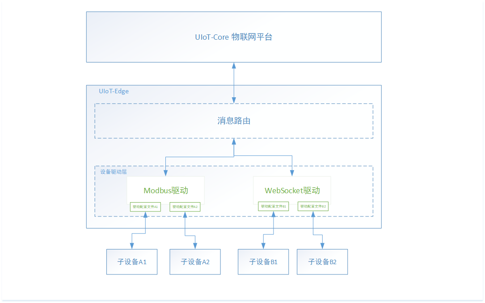

# 概览

子设备接入是边缘网关的核心功能，边缘网关通常能够为那些不能直接接入云平台的设备提供代理，帮助实现子设备消息的上行下行。

子设备的接入通常包括数据采集传感器、工业控制设备、可编程逻辑控制器(PLC)等设备，这些设备的与边缘网关的通信协议也存在多样性，所以子设备的接入要解决各类协议的问题。

UIoT Edge提供子设备接入的通用框架，能够方便使用不同协议的设备接入网关，涉及以下几个概念：

- 协议驱动：实现子设备接入配置、协议解析、子设备上下线的功能模块；
- 驱动框架：UIoT Edge提供一套协议接入框架，用户根据框架实现相应的功能，就能将设备通过私有协议接入网关，完成子设备的数据上云；

驱动模块的功能包括：

- 管理子设备：添加、删除子设备；
- 消息转发：上下线消息、上下行消息转发、协议转换、数据格式转换；
- 配置管理：配置驱动本身的参数以及每个接入的子设备的参数；

## 驱动框架支持情况

UIoT Edge目前驱动框架支持C和Python3，同时官方提供Modbus的C语言和Python3驱动：

| 官方驱动                                                | 自定义驱动                                               |
| ------------------------------------------------------- | -------------------------------------------------------- |
| Modbus（C语言、Python3） WebSocket（C语言、Python3） | C语言开发框架（含示例） Python3驱动开发框架（含示例） |

## 子设备接入流程

1. [创建子设备]()，比如Modbus温度传感器A；

2. 选择合适的编程语言，基于[驱动开发框架]()，完成Modbus协议驱动开发；

3. [添加驱动]()到驱动管理列表；

4. [分配驱动]()到网关设备，修改[驱动配置文件]()；

5. 绑定子设备到该驱动，修改[设备配置文件]();

6. 重新部署，下发驱动更改情况到边缘网关，进行测试运行，驱动部署后运行框图如下图。

   

