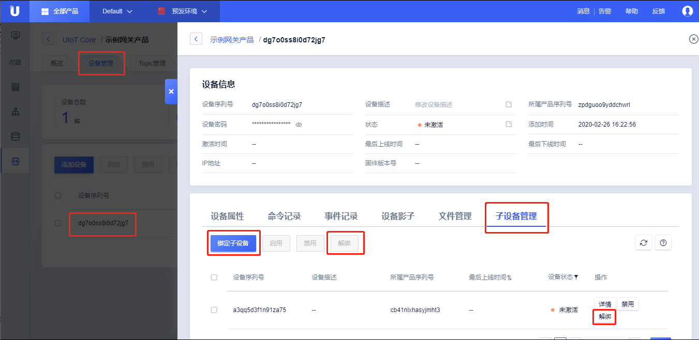
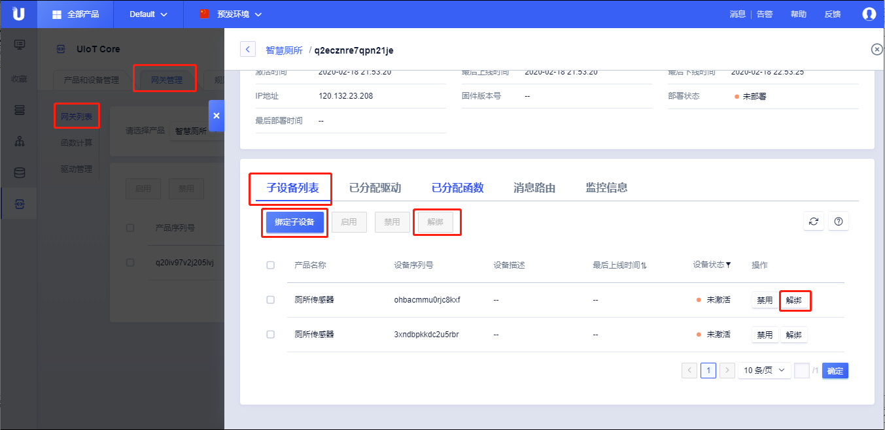

# 关联子设备

关联子设备，就是将子设备绑定到某个网关下面，从而让网关可以代理子设备上发或接收消息。关联子设备需要先[创建网关]()、[创建子设备]()。

关联子设备到网关分为静态绑定和动态绑定两种：

- 静态绑定：子设备在控制台或者调用[API接口]()将子设备绑定到某个网关。
- 动态绑定：通过[子设备驱动接口调用]()将子设备绑定到网关。

注意事项：

- 子设备不能直接接入物联云平台，必须要绑定在某个网关下，通过后者代理接入云平台；
- 子设备只能绑定到一个网关；


## 静态绑定

### 通过控制台绑定

控制台提供两种方法绑定及解绑子设备到网关设备。

- 通过网关设备详情页，添加子设备到网关的绑定关系，参考[创建网关]()
  1. 选择<产品和设备管理>标签；
  2. 单击需要绑定的网关产品，进入产品详情页；
  3. 选择<设备管理>标签；
  4. 单击需要绑定的网关设备，进入设备详情页；
  5. 选择<子设备管理>标签；
  6. 点击<绑定子设备>，选择<子设备产品>，选择相应的子设备序列号，点击确定；
  7. 选定<子设备序列号>，点击<解绑>，则解绑子设备与网关的拓扑关系；



- 通过网关管理标签，网关列表的详情页，添加子设备到网关的绑定关系，参考[网关管理]()
  1. 选择<网关管理>标签；
  2. 点击<网关列表>，选择需要绑定的网关产品；
  3. 选择对应的网关设备序列号，点击<详情>；
  4. 在滑窗中点击<子设备列表>；
  5. 点击<绑定子设备>，选择<子设备产品>，选择相应的子设备序列号，点击确定；
  6. 选定<子设备序列号>，点击<解绑>，则解绑子设备与网关的拓扑关系；



### 调用API接口绑定

接口[bindsubdevice]()提供了绑定子设备到固定网关的能力，参考[[bindsubdevice]()]()。

TODO:

## 动态绑定

动态绑定是指由子设备驱动发起添加子设备拓扑结构，动态绑定详情可以参考[子设备驱动与接入]()。

- 通过`add` Topic添加或删除拓扑结构，子设备驱动实现子设备的动态绑定；
- 通过`found` Topic添加或删除拓扑结构，除了子设备驱动外，还需要应用侧程序参与动态绑定；

#### 通过`add` Topic添加或删除拓扑关系

1. 获取子设备的ProductSN、DeviceSN、DeviceSecret，可以通过读取驱动配置或查询烧录到子设备固件中的信息两种方式，以实际情况为准；

2. 调用子设备驱动接口，请求添加或删除拓扑结构；

   - 添加拓扑结构

   ```json
   Publish Topic:/$system/${productSN}/${deviceSN}/subdev/topo/add
   
   Payload:
   {
     "RequestID": "123",
     "Params": [
       {
         "ProductSN": "product1234",
         "DeviceSN": "device1234"
       }
     ]
   }
   ```

   - 删除拓扑结构

   ```json
   Publish Topic:/$system/${productSN}/${deviceSN}/subdev/topo/delete
   
   Payload:
   {
     "RequestID": "123",
     "Params": [
       {
         "ProductSN": "product1234",
         "DeviceSN": "device1234"
       }
     ]
   }
   ```

3. 获取添加或删除拓扑结构成功消息；

   - 添加拓扑结构响应

   ```json
   Subscribe Topic: /$system/${productSN}/${deviceSN}/subdev/topo/add_reply
   
   Payload:
   {
     "RequestID": "123",
     "RetCode": 0
   }
   ```

   - 删除拓扑结构响应

    ```json
   Subscribe Topic: /$system/${productSN}/${deviceSN}/subdev/topo/delete_reply
    
   Payload:
   {
     "RequestID": "123",
     "RetCode": 0
   }
    ```

4. 添加或删除成功后，网关同时会获取到云平台的notify消息；

   TODO: check
   
   ```json
   Subscribe Topic: /$system/${productSN}/${deviceSN}/subdev/topo/notify/delete
   
   Payload:
   {
     "RequestID": "123",
     "Params": [
       {
         "ProductSN": "product1234",
         "DeviceSN": "device1234",
         "DeviceSecret": "xxxxx"
       }
     ]
}
   ```
   
   

#### 通过found Topic添加拓扑关系

1. 网关发现子设备，获取子设备的productSN、deviceSN；

2. 网关上报发现设备；

   ```json
   Publish Topic: /$system/${productSN}/${deviceSN}/subdev/topo/found
   
   Payload:
   {
     "RequestID": "123",
     "Params": [
       {
         "ProductSN": "product1234",
         "DeviceSN": "device1234",
         "ProductSecret": "123456"
       }
     ]
   }
   ```

3. 配置规则引擎转发上述数据到客户应用程序；

4. 客户应用程序判断是否要绑定，并调用[添加拓扑API]()添加该设备的拓扑关系；

5. 客户应用程序下发添加成功消息；

   TODO：云平台还是，应用程序？

   ```json
   Subscribe Topic: /$system/${productSN}/${deviceSN}/subdev/topo/found_reply
   
   Payload:
   {
     "RequestID": "123",
     "RetCode": 0
   }
   ```

6. 添加成功后，云平台同时会下发notify；

   ```json
   Subscribe Topic: /$system/${productSN}/${deviceSN}/subdev/topo/notify/add
   
   Payload:
   {
     "RequestID": "123",
     "Params": [
       {
         "ProductSN": "product1234",
         "DeviceSN": "device1234",
         "DeviceSecret": "xxxxx"
       }
     ]
   }
   ```

