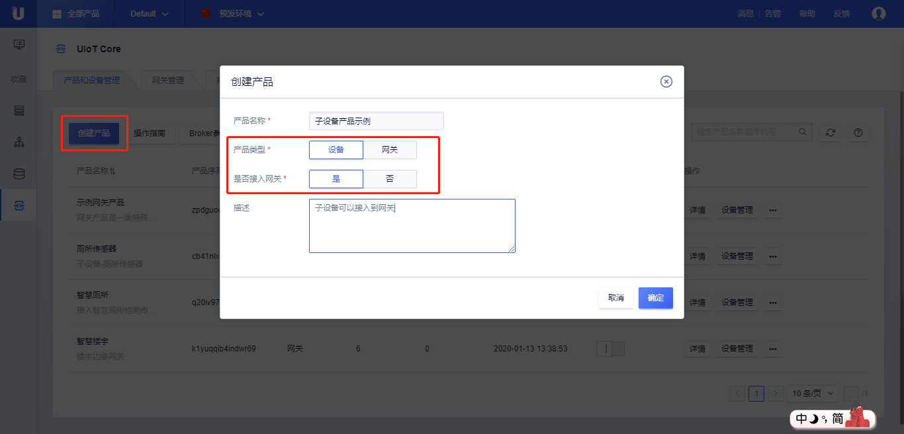
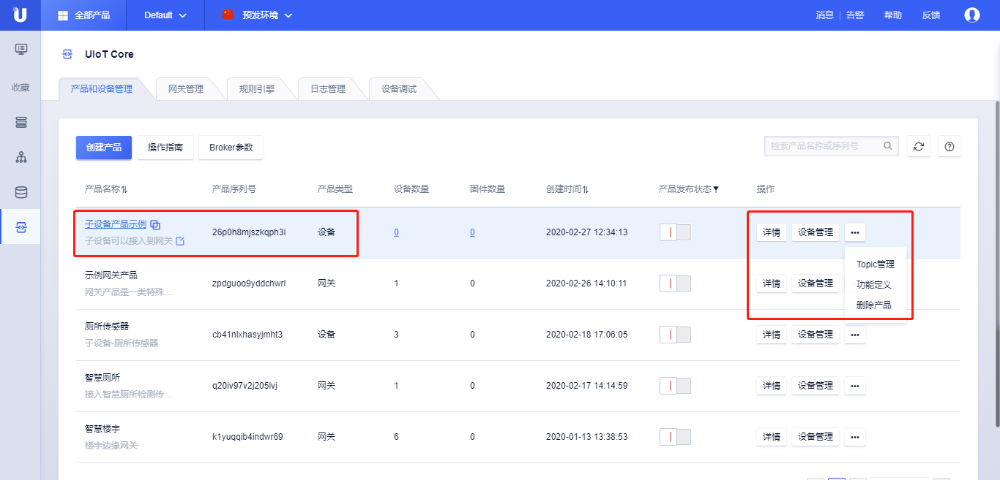
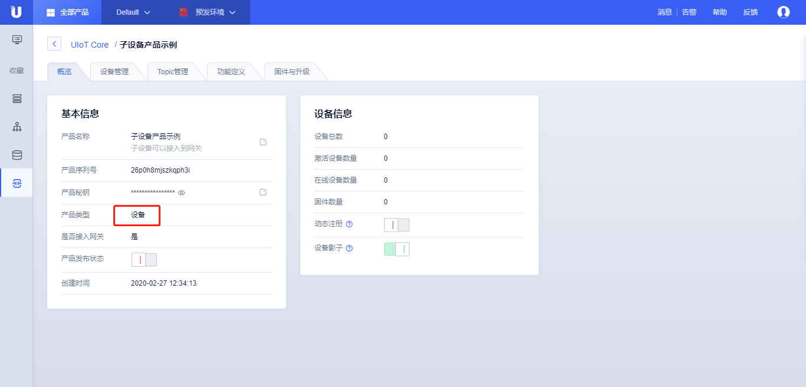
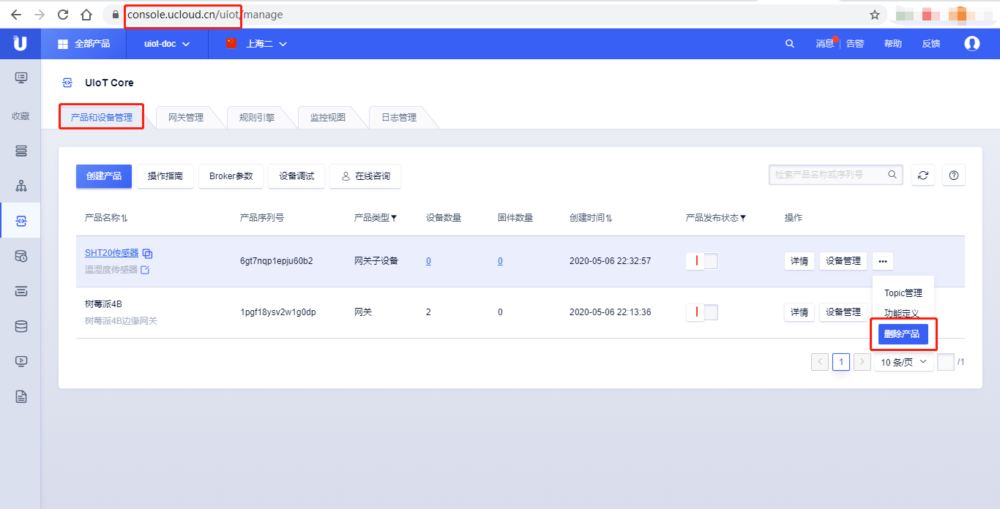
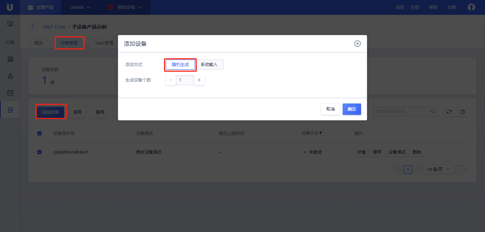
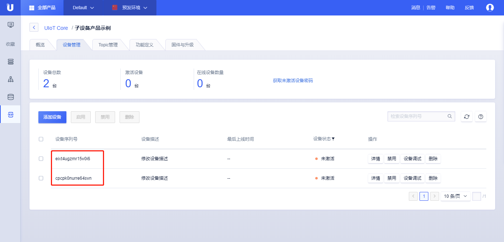
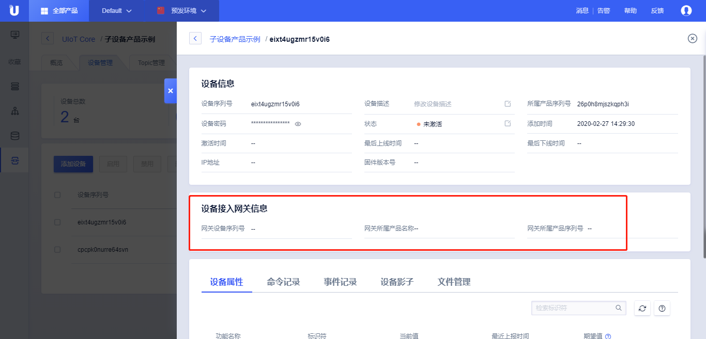

# 创建子设备

子设备是指通过网关代理才能接入云平台的一类设备，子设备的特点：

- 子设备必须绑定到某个网关下面才能使用；
- 子设备本身不能通过MQTT直接接入物联网平台，否则会提示子设备无权限登录；

创建**网关子设备**需要两步：

1. 创建**网关子设备**类型的产品，此时平台会自动生成唯一的属于该产品的产品序列号；
2. 在第一步创建的**网关子设备**类型的产品下创建属于该产品的设备；

## 创建子设备产品

### 操作步骤 

1. 登录进入UCloud[物联网平台](https://console.ucloud.cn/uiot)
2. 选择<产品和设备管理>标签，点击<创建产品>
3. 在弹出的对话框中输入<产品名称>和产品<描述>，选择产品类型为网关子设备
   - 产品名称：名称长度为4-32个字符，可包含中文、字母、数字、`_`、`-`、`@`、`:`的组合；
   - 产品类型：网关子设备；
   - 描述：支持任意字符，长度限制0-100个字符；

4. 点击<确定>，创建**网关子设备产品**成功；
5. 创建**网关子设备**产品成功后，可以在产品列表页查看该产品，类型为**网关子设备**
   - 点击<产品名称>或<详情>，进入**网关产品**详情页；
   - 产品类型，该产品的类型为网关；
   - 点击<设备数量>，进入[设备管理](https://docs.ucloud.cn/iot/uiot-core/console_guide/product_device/create_devcies?id=管理设备)页；
   - 点击<固件数量>，进入[固件管理](https://docs.ucloud.cn/iot/uiot-core/console_guide/ota/firmware_management)页；
   - 创建时间：产品创建的时间，可以进行排序显示；
   - 点击<产品发布状态>，发布产品或取消发布产品，产品一旦发布将不能修改物模型、Topic等，可以进行筛选；
   - 点击<设备管理>，进入[设备管理](https://docs.ucloud.cn/iot/uiot-core/console_guide/product_device/create_devcies?id=管理设备)页；
   - 点击<...>，进行[Topic管理](https://docs.ucloud.cn/iot/uiot-core/console_guide/product_device/topic)，[功能定义](https://docs.ucloud.cn/iot/uiot-core/console_guide/thingmode/thingmode_guide)，[删除产品](https://docs.ucloud.cn/iot/uiot-core/console_guide/product_device/create_products?id=删除产品)操作；

### 子设备产品详情

创建完**网关子设备产品**后，点击<详情>或者点击<产品名称>，可以查看该**网关子设备产品**的相关信息，网关子设备产品与普通产品详情信息一致，具体使用可以参考UIoT Core产品的相关介绍：**[产品概览]()**、**[设备管理](https://docs.ucloud.cn/iot/uiot-core/console_guide/product_device/create_devcies?id=管理设备)**、**[Topic管理](https://docs.ucloud.cn/iot/uiot-core/console_guide/product_device/topic)**、**[功能定义（物模型）](https://docs.ucloud.cn/iot/uiot-core/console_guide/thingmode/thingmode_guide)**、**[固件与升级](https://docs.ucloud.cn/iot/uiot-core/console_guide/ota/firmware_management)**。

#### 删除子设备产品

创建完**网关子设备产品**后，点击<...>，选择<删除产品>，可以根据提示删除该产品。

## 创建子设备

创建完**网关子设备产品**后，我们可以创建属于该**网关子设备产品**的单个设备，也可以批量创建多个该类型设备，本节先介绍如何创建单个设备。

**网关子设备**创建后，就可以在网关下面将该子设备绑定上去。

### 操作步骤

1. 登录进入UCloud[物联网平台](https://console.ucloud.cn/uiot)；

2. 选择<产品和设备管理>标签；

3. 单击上述创建的**网关子设备产品**，进入**网关子设备产品**详情页；

4. 点击<设备管理>标签；

5. 点击<添加设备>，添加设备有两种方式，可以参考[随机生成]()、[手动输入]()；

6. 添加设备成功后，可以查看`设备序列号`和`设备密码`，对于网关子设备，由于其不直接接入云平台，设备密码一般用不到，只要能建立和某个网关的拓扑关系，网关会代其注册激活；

7. 设备创建成功后，可以在设备列表页查看该设备的相关信息，也可以对设备进行<启用>、<禁止>、<删除>；

### 网关子设备详情

依次点击<设备管理>标签，找到需要查看的设备，点击该设备<设备序列号>或<详情>，则进入了设备详情页。

设备详情页的基本功能可以参考[基本信息]()、[物模型属性、命令、事件]()、[设备影子]()、[文件管理]()。

- 设备接入网关信息
  - 网关设备序列号：该子设备绑定到的网关设备的序列号，`--`代表尚未绑定任何网关；
  - 网关所属产品名称：该子设备绑定到的网关设备的产品名称，`--`代表尚未绑定任何网关；
  - 网关所属产品序列号：该子设备绑定到的网关设备的产品序列号，`--`代表尚未绑定任何网关；

#### 网关子设备禁用和删除

网关子设备的禁用、删除和普通设备的禁用、删除功能一样，可以参考[设备禁用]()和[设备删除]()。

网关子设备删除注意事项：

- 删除网关子设备会自动删除该子设备和网关的绑定关系；

