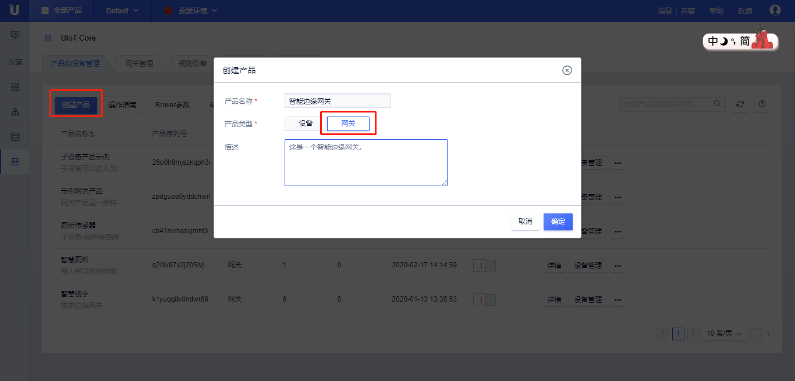
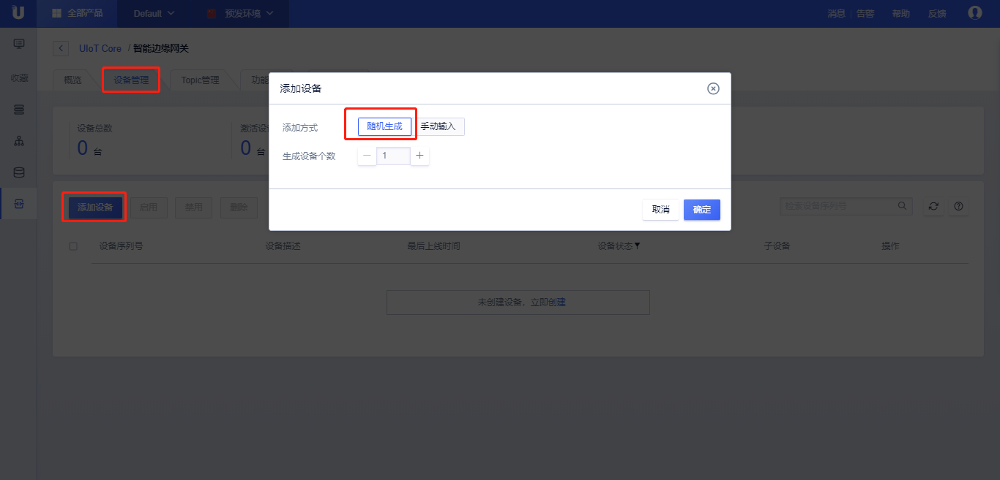
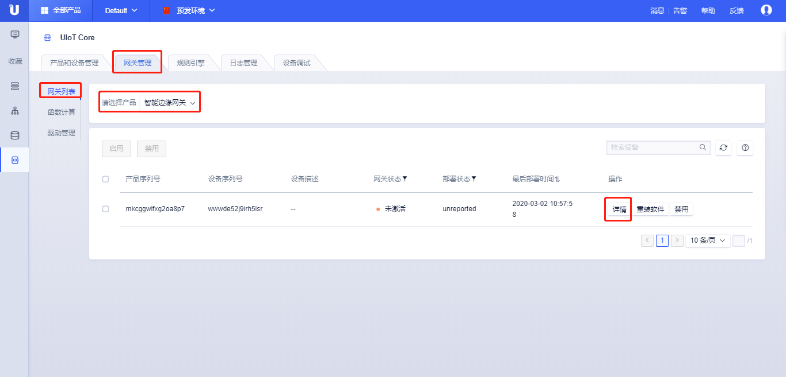
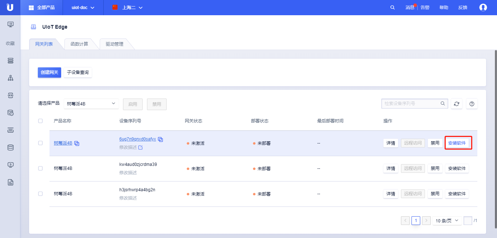
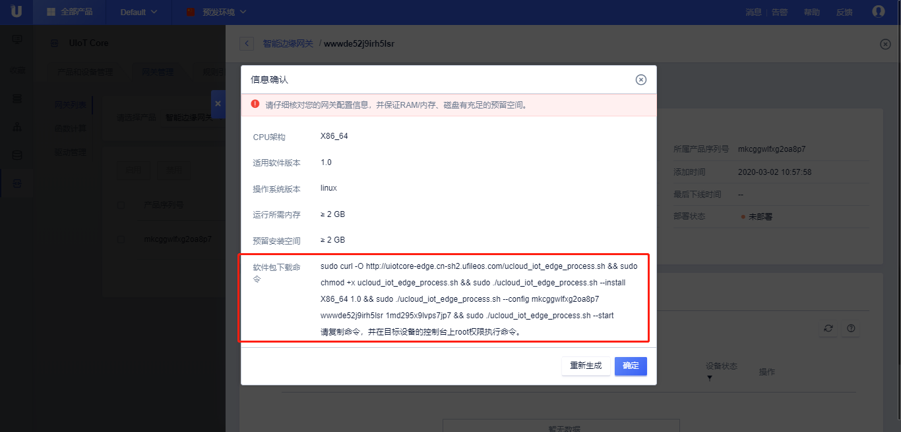
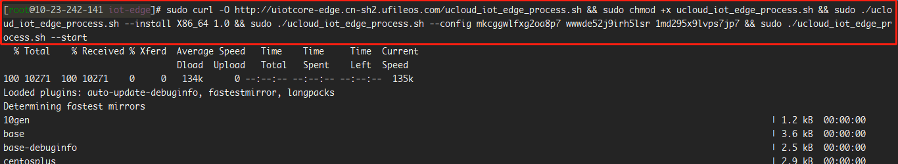
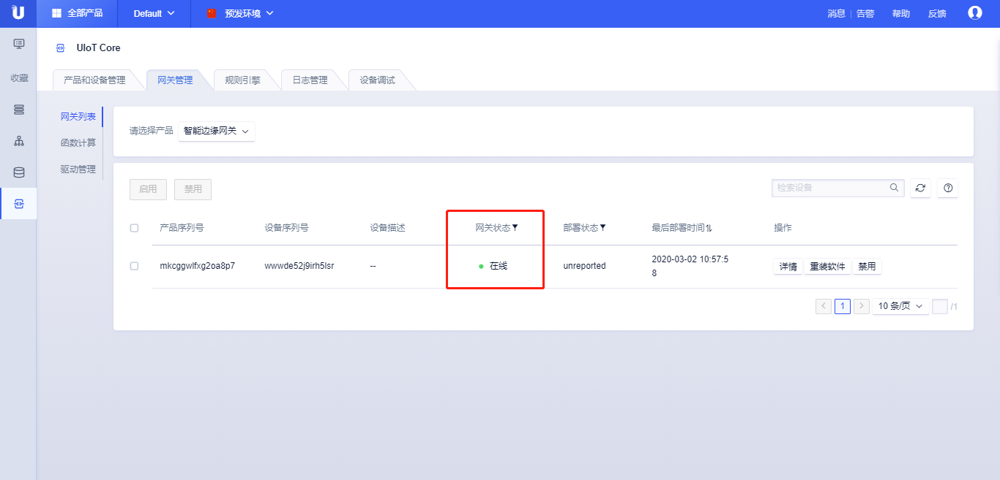
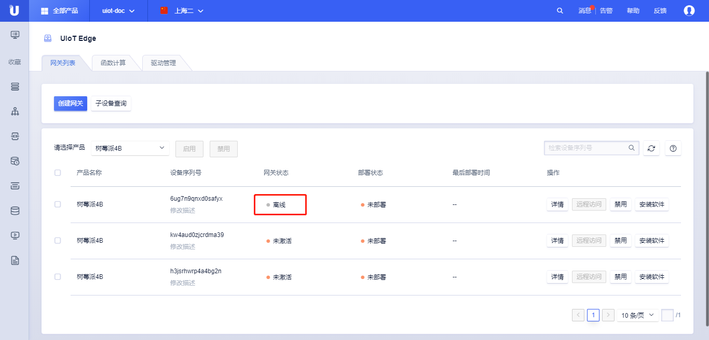

# 安装软件

安装软件是指将UCloud物联网边缘网关运行时软件包安装到边缘硬件中，本文将详细介绍如何安装UIoT Edge运行时。

本文档以安装网关到x86_64下ubuntu 18.04为例，讲解安装软件全过程。

## 准备工作

#### 网络

具有外网接入能力，能够接入公有云并连接到[UIoT Core物联网通信云平台]()。

#### 硬件

可以运行linux系统的硬件设备，架构包括：x86、armv7、armv8。

#### 操作系统

UIoT Edge仅支持运行在linux kernel ≥ xx.xx.xx TODO:下，暂不支持其他内核版本及windows系统。

linux推荐使用以下发行版本，自裁剪系统或其他发行版本可以联系服务经理或提工单，UIoT团队可提供技术支持：

- x86_64：ubuntu18.04、centos7.0
- armv7：raspbian GNU、ubuntu18.04 TODO:
- armv8：ubuntu18.04

#### 安装依赖

UIoT Edge软件包的安装依赖以下工具或命令：

- wget、
- TODO：

## 操作步骤

本文档以安装网关到x86_64下ubuntu 18.04为例，讲解安装软件全过程。

### 创建网关产品及网关设备

安装软件需要先[创建网关产品]()及[网关设备]()。网关设备创建成功后，该网关具有唯一的产品序列号ProductSN、设备序列号DeviceSN、设备密码DeviceSecret，可以获取一键安装脚本进行软件的安装。

1. 登录进入UCloud[物联网平台](https://console.ucloud.cn/uiot)
2. 创建网关产品
   - 根据[创建网关产品]()文档说明及页面提示，点击<创建产品>，选择<网关产品>，创建一个网关产品，命名为**智能边缘网关**，点击<确定>；
   - 创建完成后，点击产品的详情，可以对产品进行相应的配置，具体参考[创建网关产品]()详细说明。



3. 创建网关设备

   - 根据[创建网关设备]()文档及页面提示，依次点击<详情>、点击<设备管理>、<添加设备>、<随机生成>、<生成设备个数1个>、<确定>；
   - 创建完成后，点击设备的详情，具体参考[创建设备](https://docs.ucloud.cn/iot/uiot-core/console_guide/product_device/create_devcies)详细说明。



### 安装软件

1. 获取安装脚本
   - 在网关管理页面，点击<网关列表>、点击<请选择产品>、点击<详情>，进入该网关的可分配资源管理界面；
   - 进入详情页后，选择<安装软件>；
   - 选择<CPU架构> ---- x86_64、<适用软件版本> ---- x.x、<操作系统版本> ---- linux，<运行模式> ---- 进程或容器，点击<确定>；
   - 在弹出的**信息确认**框内，检查相关配置，获取软件包下载命令。







2. 安装软件包

   - 登录网关设备，进入安装UIoT Edge的目录，粘贴并运行上述安装命令；

     ```bash
     # 脚本安装依赖`curl`、`get`、`set`、`write` TODO等系统命令，需要提前安装。
     sudo curl -O http://uiotcore-edge.cn-sh2.ufileos.com/ucloud_iot_edge_process.sh && sudo chmod +x ucloud_iot_edge_process.sh && sudo ./ucloud_iot_edge_process.sh --install X86_64 1.0 && sudo ./ucloud_iot_edge_process.sh --config mkcggwlfxg2oa8p7 wwwde52j9irh5lsr 1md295x9lvps7jp7 && sudo ./ucloud_iot_edge_process.sh --start
     ```



   - 系统会自动下载安装软件包，并启动UIoT Edge运行时；
   - 进入物联网平台控制台，依次点击<网关管理>、<网关列表>、<选择产品>，可以查看网关目前的状态为**在线**；
   - 安装成功，边缘网关成功与物联网云平台建立连接。



## 其他操作

### 添加开机自启动

TODO

### 停用UIoT Edge

1. 登录目标边缘网关，在安装目录下，找到脚本`ucloud_iot_edge_process.sh`，执行以下命令：

   ```bash
   ucloud_iot_edge_process.sh --stop
   ```

2. 看到以下打印，则停用成功。

   ```bash
   stop all servers completed
   ```

3. 进入物联网平台控制台，依次点击<网关管理>、<网关列表>、<选择产品>，可以查看网关目前的状态为**离线**；



### 重装UIoT Edge

1. 进入物联网平台控制台，依次点击<网关管理>、<网关列表>、<选择产品>；
2. 点击<重装软件>，以下流程和[安装软件]()一致，详情请参考[安装软件]()；
3. 选择<CPU架构> ---- x86_64、<适用软件版本> ---- x.x、<操作系统版本> ---- linux，<运行模式> ---- 进程或容器，点击<确定>；
4. 在弹出的**信息确认**框内，可以查看相关配置，获取软件包下载命令；
5. 登录网关设备，粘贴并运行上述安装命令；
6. 安装成功后，登录控制台确认边缘网关状态为**在线**。

### 接入子设备

网关软件安装成功后，可以接入子设备，添加子设备驱动、配置消息路由、函数计算、远程运维，具体参考[子设备驱动与接入]()、[设置消息路由]()、[添加边缘计算]()、[远程运维管理]()。

